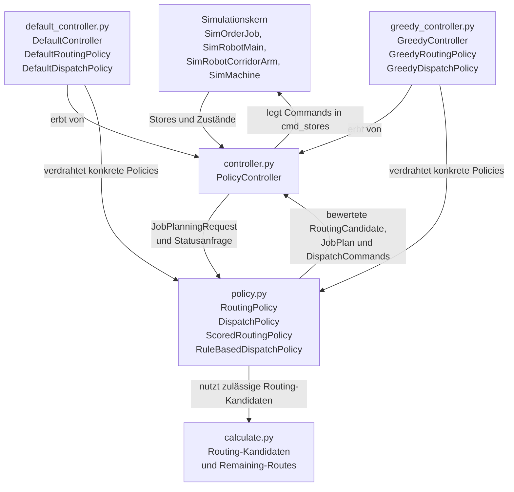

# SpineML

## Erweiterung des Simulationskerns

Im Projekt wurde der Simulationskern zunächst so erweitert, dass mehrere zuvor bereits konfigurierbare, aber im Laufzeitverhalten noch nicht wirksame Modellparameter direkt in die Simulation integriert werden.

### Zeitparameter auf Order-Ebene

Die Parameter `earliest_start_time` und `latest_end_time` aus `Order` wirken jetzt direkt im Ablauf der Simulation:

- `earliest_start_time`
  - bestimmt die Freigabe einer gesamten Order
  - Jobs einer Order werden erst ab diesem Zeitpunkt in das Startlager eingebracht
- `latest_end_time`
  - definiert den Soll-Fertigstellungszeitpunkt einer gesamten Order
  - nach Abschluss des letzten Jobs einer Order werden `completion_time`, `lateness` und `tardiness` berechnet

Damit werden Aufträge zeitlich nicht mehr sofort und implizit behandelt, sondern explizit über Release- und Due-Date-Logik modelliert.

### Speicher- und Pufferparameter

Die bisher nur in der Konfiguration vorhandenen Speicherparameter wirken nun ebenfalls im Simulationskern:

- `storage_capacity`
  - für `Layout`, `Corridor` und `Machine`
  - begrenzt die Kapazität der jeweiligen Stores
- `storage_in_time`
  - modelliert die Zeit für Einlagerungsvorgänge
- `storage_out_time`
  - modelliert die Zeit für Auslagerungsvorgänge

Dadurch entstehen erstmals reale Pufferbegrenzungen und zusätzliche Lagerzeiten im Materialfluss.

### Qualitätsparameter

Der Parameter `defect_probability` aus `OperationType` wurde in die Maschinenlogik integriert:

- nach einer Bearbeitung kann ein Job mit der angegebenen Wahrscheinlichkeit defekt werden
- defekte Jobs werden als Ausschuss markiert
- die weitere Bearbeitungsroute wird beendet
- der Ausschuss wird anschließend regulär aus dem System ausgeschleust

Damit wird Qualitätsunsicherheit erstmals explizit im Simulationskern abgebildet.

### Produktparameter

Auch zuvor ungenutzte Produktparameter wurden in Verhalten übersetzt:

- `weight`
  - beeinflusst die Bewegungsgeschwindigkeit beladener Roboter
- `length`, `width`, `depth`
  - beeinflussen zusätzliche dimensionsabhängige Bearbeitungszeit an Maschinen

Dadurch wirken Produkte nicht mehr nur als logische Typen, sondern auch über physische Eigenschaften auf den Simulationsablauf.

### Bedeutung der Erweiterung

Mit diesen Änderungen beschreibt der Simulationskern nicht mehr nur die Struktur des Spine-Layouts, sondern auch zentrale zeitliche, kapazitive, qualitative und produktspezifische Effekte.

Diese Erweiterung ist wichtig, weil spätere heuristische oder lernbasierte Steuerungsverfahren nur dann sinnvoll optimieren können, wenn die zugrunde liegende Simulation diese Einflussgrößen auch tatsächlich berücksichtigt.

## Erweiterung auf eine austauschbare Controller-Architektur

Auf Basis dieses erweiterten Simulationskerns wurde die Steuerungslogik von der eigentlichen Simulationslogik getrennt.
Ziel dieser Erweiterung ist es, unterschiedliche Steuerungsverfahren einsetzen zu können, ohne den Simulationskern für Roboter, Maschinen, Queues und Layouts jeweils neu anpassen zu müssen.

Die zentrale Idee ist:

- der Simulationskern beschreibt nur noch Zustände und Ausführung
- der Controller liest den Systemzustand periodisch ein
- die eigentliche Entscheidungslogik liegt in austauschbaren Policies
- Maschinen und Roboter führen nur noch die vom Controller erzeugten Commands aus

Damit entsteht eine klarere Schnittstelle zwischen Steuerung und Simulation und gleichzeitig eine Grundlage für spätere heuristische oder lernbasierte Verfahren.

### Strukturdiagramm: Aufbau von Simulation und Controller

Das folgende Diagramm zeigt die grobe Struktur zwischen Simulationskern, der allgemeinen Controller-Logik in `controller.py`, den abstrakten Policy-Schnittstellen in `policy.py`, den Routing-Hilfsfunktionen in `calculate.py`, den Beobachtungs- und Command-Typen aus `types.py` sowie den konkreten Default- bzw. Greedy-Implementierungen.

## Überblick über die neue Struktur

Die Erweiterung konzentriert sich auf das Paket `sources/SpineML/controller/`.
Dort wurde die Steuerung in mehrere Bausteine aufgeteilt:

- `types.py`
- `calculate.py`
- `policy.py`
- `controller.py`
- `default_controller.py`
- `greedy_controller.py`

Zusätzlich wurde der Simulationskern im Ordner `sources/SpineML/Simulation/` so angepasst, dass Roboter und Maschinen ihre Entscheidungen nicht mehr selbst treffen, sondern Commands aus actor-spezifischen Command-Stores verarbeiten.

Der zentrale Architekturgedanke hinter den unterschiedlichen Controllern ist dabei:

- `calculate.py` erzeugt für das Routing den zulässigen Suchraum
  - also mögliche Operationsfolgen und dazu passende Maschinenfolgen
- `RoutingPolicy` bewertet diese Routing-Kandidaten initial und später erneut aus dem aktuellen Produktzustand eines Jobs
- `DispatchPolicy` wählt während der laufenden Simulation aus den aktuell möglichen Aktionen die nächsten Commands aus
  - dieser dynamische Aktionsraum ist damit ein zweiter, laufend neu entstehender Suchraum
- die beim `place` ausgewählte Route wird erst in diesem Transport-Schritt am echten Job festgeschrieben
- Maschinen können zusätzlich aus allen Jobs ihrer `input_queue` den aktuell besten Bearbeitungskandidaten auswählen

Damit ist die Aufgabenverteilung bewusst getrennt:

- `calculate.py` beantwortet die Frage:
  - welche Routing-Kandidaten sind im gegebenen Layout grundsätzlich zulässig?
- `RoutingPolicy` beantwortet die Frage:
  - welche verbleibenden Routen sind für den aktuellen Job zulässig und wie gut sind sie?
- `DispatchPolicy` beantwortet die Frage:
  - welche ausführbare Aktion inklusive zugehöriger Route im aktuellen Simulationszustand als Nächstes erfolgen soll?
  - also welche aus der momentanen Queue-, Maschinen- und Roboterkonstellation ableitbare Aktion lokal am sinnvollsten ist

Genau darin unterscheiden sich `DefaultController` und `GreedyController`:

- beide nutzen dieselben Simulationsdaten und dieselbe Controller-Schnittstelle
- beide nutzen für das Routing dieselben in `calculate.py` erzeugten zulässigen Kandidaten
- der Unterschied liegt in der Auswahlregel:
  - die Default-Policies bilden eine einfache Baseline
  - die Greedy-Policies bewerten Kandidaten heuristisch über Score-Funktionen und wählen jeweils die lokal beste Alternative

Die eigentliche Optimierung liegt also nicht in der Erzeugung des Suchraums, sondern in der Bewertung und Auswahl innerhalb dieses Suchraums.
Für das Routing geschieht das nicht mehr nur einmalig pro Job, sondern initial und danach erneut zwischen Bearbeitungsschritten.
Für das Dispatching geschieht die Auswahl fortlaufend während der Simulation.

### Rolle der Heuristik

Aus Sicht der Heuristik existieren in der Architektur zwei verschiedene Suchräume:

- ein Routing-Suchraum bei der Initialplanung und später erneut für beobachtete Transportjobs
  - bestehend aus möglichen `operation_sequence`- und `machine_sequence`-Kandidaten sowie daraus abgeleiteten `RoutingCandidate`s
- ein dynamischer Dispatch-Suchraum während der laufenden Simulation
  - bestehend aus den aktuell ausführbaren Aktionen für Main-Roboter, Arm-Roboter und Maschinen einschließlich der Jobs in `machine.input_queue.jobs`

Die Rolle der Heuristik besteht darin, in beiden Suchräumen zulässige Alternativen nicht nur zu erzeugen, sondern zu bewerten und daraus eine sinnvolle Auswahl zu treffen.

Konkret bedeutet das:

- beim Routing:
  - welcher verbleibende Bearbeitungsweg für einen Job im aktuellen Produktzustand gewählt werden soll
- beim Dispatching:
  - welche im aktuellen Systemzustand ausführbare Aktion als Nächstes erfolgen soll und welche Route dabei commitet wird

Die Heuristik übernimmt damit in der Fabrik nicht die Modellierung der Welt, sondern die Entscheidungslogik innerhalb dieser modellierten Welt.
Der Simulationskern beschreibt, welche Zustände, Ressourcen und Restriktionen existieren.
Die Heuristik entscheidet, welche der jeweils möglichen Optionen unter diesen Bedingungen bevorzugt werden sollen.

## Controller-Module

### `types.py`

`types.py` definiert die Datenschnittstelle zwischen Controller und Simulation.
Hier werden die Objekte beschrieben, mit denen der Controller arbeitet.
Die Typen sind dabei nicht auf einen bestimmten Controller zugeschnitten, sondern bilden den gemeinsamen Datenvertrag für `DefaultController`, `GreedyController` und spätere weitere Steuerungsverfahren.

Dazu gehören insbesondere:

- `JobKey`
  - eindeutige Identifikation einer Produktionseinheit über Szenario, Order und Jobnummer
- `JobPlanningRequest`
  - Anfrage an die Routing-Logik für die Planung eines Jobs
  - enthält zusätzlich `current_product_type` für die verbleibende Online-Planung ab dem aktuellen Produktzustand
- `JobPlan`
  - Ergebnis der Jobplanung mit `operation_sequence` und `machine_sequence`
- `RoutingCandidate`
  - beschreibt eine zulässige verbleibende Route mit Operationsfolge, Maschinenfolge, Score und den daraus abgeleiteten nächsten Bearbeitungsschritten
- `JobHeadObservation`
  - detaillierte Beobachtung eines Jobs am Kopf einer Queue
  - enthält neben Produkt- und Routendaten inzwischen auch heuristisch relevante Informationen wie `is_defective`, `release_time`, `due_time`, `remaining_processing_time_estimate`, `slack_time` sowie aktuelle Produktparameter wie Gewicht und Abmessungen
  - enthält zusätzlich `routing_candidates`, also mehrere aktuell mögliche verbleibende Routen
- `QueueObject`
  - Beobachtung einer Queue mit Länge, Head-Job und allen aktuell sichtbaren Jobs
  - enthält zusätzlich `capacity`, `free_capacity` und `jobs`
- `OrderJobObservation`
  - detaillierte Beobachtung eines konkreten Jobs innerhalb einer Order
  - enthält zusätzlich `released`, `completed`, `completion_time` und `defect_time`
- `SystemObservation`
  - vollständige Beobachtung des Systems aus Sicht des Controllers
- `DispatchCommand`
  - allgemeiner Command an einen Actor
- `MainRobotCommand`, `ArmRobotCommand`, `MachineCommand`
  - konkrete Commands für die jeweiligen Actoren

Diese Typen bilden die eigentliche Schnittstelle zwischen Simulationskern und Steuerungslogik.
Gleichzeitig stellen sie genau die Beobachtungen bereit, auf deren Basis später heuristische oder lernbasierte Strategien Entscheidungen treffen können.

### `calculate.py`

`calculate.py` enthält die Logik zur Berechnung möglicher Operations- und Maschinenfolgen.
Diese Funktionen erzeugen den zulässigen Suchraum für das Routing und werden von Routing-Policies genutzt.
Die eigentliche Auswahlentscheidung wird dabei bewusst nicht in `calculate.py` getroffen, sondern in der jeweils aktiven Routing-Policy.

Hier wird also berechnet:

- welche Operationsfolgen für ein Produkt möglich sind
- welche Maschinenfolgen für eine Operationsfolge im gegebenen Layout möglich sind
- welche verbleibenden Operationsfolgen vom aktuellen Produktzustand bis zum Zielprodukt möglich sind

Sowohl `DefaultRoutingPolicy` als auch `GreedyRoutingPolicy` greifen damit auf dieselbe Menge zulässiger Routing-Kandidaten zu.
Der Unterschied liegt nicht in der Erzeugung dieser Kandidaten, sondern in ihrer späteren Bewertung und Auswahl.

### `policy.py`

`policy.py` definiert die austauschbaren Steuerungsschnittstellen.
Die Datei enthält dabei bewusst nur die abstrakten Verträge und gemeinsame Basisklassen, nicht aber konkrete Default- oder Greedy-Strategien.

Es gibt zwei zentrale Policy-Arten:

- `RoutingPolicy`
  - stellt zulässige Routing-Kandidaten für einen Job bereit
  - kann daraus weiterhin ein konkretes `JobPlan` ableiten
- `DispatchPolicy`
  - entscheidet im laufenden Betrieb, welche Commands als Nächstes erzeugt werden sollen

Die Routing-Policies nutzen dabei die von `calculate.py` berechneten zulässigen Alternativen und treffen daraus die eigentliche Auswahlentscheidung.
Damit liegt die Entscheidungslogik bewusst in `policy.py` und nicht im Simulationskern oder in den Hilfsfunktionen zur Kandidatenerzeugung.

Zusätzlich gibt es:

- `RuleBasedDispatchPolicy`
  - ein regelbasiertes Gerüst für Dispatching
  - zerlegt die Gesamtentscheidung in kleinere Teilentscheidungen:
    - `decide_main_robot_pick(...)`
    - `decide_main_robot_place(...)`
    - `decide_arm_robot_pick(...)`
    - `decide_arm_robot_place(...)`
    - `decide_machine_process(...)`
  - baut dabei `place`-Kandidaten aus mehreren `RoutingCandidate`s auf
  - erlaubt Maschinen zusätzlich, mehrere Jobs aus ihrer `input_queue` gegeneinander zu vergleichen, statt strikt FIFO zu arbeiten

Damit muss eine neue Dispatch-Strategie nicht zwingend die gesamte Methode `decide(...)` selbst schreiben, sondern kann auf diesem Gerüst aufbauen.

Auf dieser Basis unterscheiden sich die konkreten Policies:

- die Default-Policies bilden eine einfache Baseline
- die Greedy-Policies bewerten Kandidaten heuristisch und wählen jeweils die lokal beste Alternative

### `controller.py`

`controller.py` enthält den eigentlichen Laufzeit-Controller.

Die zentrale Klasse ist:

- `PolicyController`

`PolicyController` ist selbst eine `salabim.Component` und übernimmt die Vermittlung zwischen Simulation und Policies.

Seine Aufgaben sind:

- Speichern der aktiven `RoutingPolicy`
- Speichern der aktiven `DispatchPolicy`
- Beobachten aller relevanten Simulationsobjekte
- Umwandeln von Simulationszuständen in typisierte Beobachtungen
- Erzeugen dynamischer `routing_candidates` für beobachtete Transportjobs
- periodisches Aufrufen der Dispatch-Logik
- Verteilen der resultierenden Commands auf die jeweiligen Actoren

Wichtig ist dabei, dass `controller.py` selbst keine fachliche Routing- oder Dispatch-Entscheidung trifft.
Der Controller orchestriert nur den Ablauf zwischen Simulationskern und den aktuell eingesetzten Policies.
Dadurch können unterschiedliche Steuerungsverfahren eingesetzt werden, ohne den Controller oder den Simulationskern selbst umschreiben zu müssen.

Technisch wichtig ist dabei:

- jeder Actor besitzt einen eigenen `cmd_store`
- der Controller verwaltet eine Zuordnung `actor_id -> cmd_store`
- neue Commands werden über diese Zuordnung an den richtigen Actor geschickt

Der `PolicyController` enthält dafür insbesondere:

- Statusfunktionen für Jobs, Roboter und Maschinen
- `read_status()` zum Erzeugen eines `SystemObservation`
- `build_commands()` zum Aufruf der aktiven Dispatch-Policy
- `process()` als periodische Controller-Schleife

Für Jobs in Transport-Queues werden dabei mehrere Routing-Kandidaten beobachtet.
Für Jobs in einer Maschinen-`input_queue` bleibt dagegen die bereits festgeschriebene Route sichtbar, damit die Maschinenbearbeitung konsistent auf einer konkret gewählten nächsten Operation basiert.

Die Schleife läuft konzeptionell so:

1. Systemzustand lesen
2. aktive Policy aufrufen
3. Commands erzeugen
4. Commands in die passenden `cmd_store`s legen
5. kurzes Intervall warten
6. erneut beginnen

### `default_controller.py`

`default_controller.py` enthält die erste konkrete Standardimplementierung.
In dieser Datei liegen neben `DefaultController` auch die konkreten Baseline-Implementierungen `DefaultRoutingPolicy` und `DefaultDispatchPolicy`.

Definiert wird hier:

- `DefaultRoutingPolicy`
- `DefaultDispatchPolicy`
- `DefaultController`

Die aktuelle Baseline arbeitet wie folgt:

- `DefaultRoutingPolicy`
  - bewertet zulässige Operationsfolgen und Maschinenfolgen rein zufällig
  - erzeugt daraus auch im Online-Routing lediglich zufällige `RoutingCandidate`s
  - wählt damit keine fachlich optimierte Route, sondern eine einfache Referenzlösung innerhalb des zulässigen Suchraums
- `DefaultDispatchPolicy`
  - bewertet mögliche Pick-, Place- und Maschinenaktionen ebenfalls zufällig
  - vergleicht dabei dieselben Online-Routing-Kandidaten und dieselben Maschinen-Queue-Kandidaten wie die Greedy-Variante
  - verwendet damit bewusst keine Prioritäten bezüglich Due-Date, Stau, Restbearbeitungszeit oder Defektrisiko
  - bildet dadurch eine einfache Baseline für spätere heuristische Vergleiche
- `DefaultController`
  - erbt von `PolicyController`
  - erzeugt standardmäßig eine `DefaultRoutingPolicy` und eine `DefaultDispatchPolicy`
  - übergibt beide an den allgemeinen Controller

Damit ist eine lauffähige Baseline vorhanden, ohne dass die eigentliche Entscheidungslogik im Controller selbst dupliziert werden muss.

### `greedy_controller.py`

`greedy_controller.py` enthält eine erste heuristische Variante der Steuerung.
Analog zu `default_controller.py` liegen in dieser Datei sowohl die heuristischen Policy-Implementierungen als auch der verdrahtende Controller.

Definiert wird hier:

- `GreedyRoutingPolicy`
- `GreedyDispatchPolicy`
- `GreedyController`

Dabei gilt:

- `GreedyRoutingPolicy`
  - bewertet mögliche Operations- und Maschinenfolgen über Score-Funktionen
  - erzeugt daraus sortierte `RoutingCandidate`s für die aktuelle Restplanung eines Jobs
  - bevorzugt kurze Bearbeitungszeiten, geringe Defektrisiken, wenige Korridorwechsel und kurze Transferwege
  - stellt diese Kandidaten für Main- und Arm-Roboter beim `place` online zur Verfügung
- `GreedyDispatchPolicy`
  - bewertet mögliche nächste Aktionen im aktuell verfügbaren Dispatch-Suchraum für Main-Roboter, Arm-Roboter und Maschinen
  - nutzt dafür unter anderem `slack_time`, freie Zielkapazität, Restbearbeitungsdauer, verbleibende Bearbeitungsschritte und den Score der jeweils ausgewählten Route
  - bevorzugt zusätzlich das Leeren von `machine_out` und `corridor_main`, um Blockierungen zu reduzieren
  - wählt bei Maschinen den besten Job aus der gesamten `input_queue` statt nur den Head-Job
  - lässt Bearbeitungsschritte für bereits defekte Jobs nicht mehr zu
- `GreedyController`
  - erbt von `PolicyController`
  - erzeugt standardmäßig eine `GreedyRoutingPolicy` und eine `GreedyDispatchPolicy`
  - übergibt beide an den allgemeinen Controller

Damit steht neben der Standard-Baseline bereits eine erste austauschbare Greedy-Heuristik zur Verfügung.

## Benchmarking und Dashboard

Mit der Einführung austauschbarer Controller reicht es nicht mehr aus, eine neue Strategie nur zu implementieren.
Sobald neben `DefaultController` auch weitere Varianten wie `GreedyController` existieren, stellt sich unmittelbar die Frage, ob diese Strategien unter gleichen Bedingungen tatsächlich andere oder bessere Ergebnisse liefern.

Genau aus diesem Grund wurden zusätzlich eine Benchmark-Schicht und ein Dashboard implementiert:

- unterschiedliche Controller sollen auf denselben Beispielen vergleichbar ausgeführt werden können
- Zufallseinflüsse sollen über gemeinsame Seeds kontrollierbar bleiben
- Ergebnisse sollen nicht nur beobachtet, sondern auch als Kennzahlen gespeichert und ausgewertet werden
- die Austauschbarkeit der Controller soll damit nicht nur architektonisch, sondern auch experimentell nachweisbar sein

Die Benchmarking-Schicht ermöglicht damit den Übergang von einer rein lauffähigen Architektur zu einer auswertbaren Versuchsplattform für Baselines, Greedy-Heuristiken und spätere weitere Verfahren.

### `benchmark.py`

`benchmark.py` enthält die eigentliche Benchmark-Logik.
Die Datei ist damit die fachliche Vergleichsschicht zwischen Simulationskern und den konkreten Auswertungswerkzeugen.

Ihre Aufgaben sind insbesondere:

- Laden von Beispielmodellen über `build_example()`
- Zurücksetzen des globalen Konfigurationszustands zwischen Benchmark-Läufen
- Erzeugen und Ausführen von Simulationsläufen mit unterschiedlichen Controllerklassen
- Setzen gemeinsamer Seeds für faire und reproduzierbare Vergleiche
- Sammeln strukturierter Kennzahlen pro Run und pro Order
- Serialisieren der Ergebnisse in einen JSON-Report

Dabei werden unter anderem folgende Kennzahlen erfasst:

- `completed_jobs`, `completed_orders`
- `defective_jobs`
- `total_tardiness`, `average_tardiness`, `max_tardiness`
- `makespan`
- `throughput_jobs_per_time`
- `robot_utilization`, `machine_utilization`
- Queue-Längen für Start, Ende, Corridor und Maschinenpuffer

Damit bildet `benchmark.py` die technische Grundlage für reproduzierbare Controller-Vergleiche.

### `benchmark_runner.py`

`benchmark_runner.py` ist die schlanke Kommandozeilen-Schnittstelle für die Benchmark-Schicht.
Die Datei dient dazu, Benchmark-Läufe schnell auszuführen, ohne den Python-Code jedes Mal manuell anpassen zu müssen.

Der Runner übernimmt dabei:

- Auswahl von Beispielskripten
- Auswahl der zu vergleichenden Controller, z. B. `default` und `greedy`
- Übergabe von Seeds
- Setzen einer optionalen Simulationsgrenze `till`
- Speichern des Reports als JSON-Datei
- kompakte Konsolenausgabe der wichtigsten Kennzahlen pro Run

Dadurch eignet sich `benchmark_runner.py` vor allem für:

- schnelle Vergleiche im Terminal
- wiederholbare Benchmark-Experimente
- das Erzeugen von JSON-Reports für spätere Auswertung

### `benchmark_dashboard.py`

`benchmark_dashboard.py` stellt auf Basis von Streamlit eine grafische Oberfläche für die Benchmark-Ergebnisse bereit.
Die Datei wurde implementiert, damit die Auswertung nicht nur über rohe JSON-Dateien oder Konsolenzeilen erfolgen muss.

Das Dashboard ermöglicht:

- bestehende JSON-Reports zu laden
- neue Benchmark-Läufe direkt aus der Oberfläche zu starten
- Controller, Beispiele, Seeds und `till` interaktiv auszuwählen
- aggregierte Kennzahlen pro Controller zu vergleichen
- Run-Details und Order-Details tabellarisch anzuzeigen
- Reports erneut als JSON im Projektordner zu speichern oder herunterzuladen

Damit bildet das Dashboard die visuelle Auswertungsebene über der eigentlichen Benchmark-Logik.
Es ersetzt nicht den Benchmark selbst, sondern macht dessen Ergebnisse für Vergleiche und Analyse deutlich leichter nutzbar.
