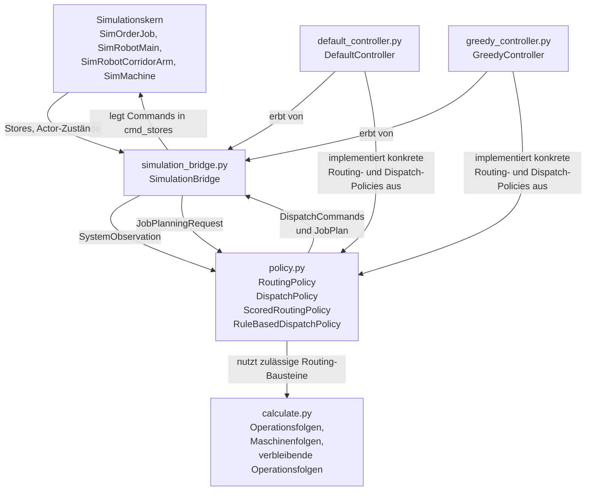

# SpineML

SpineML ist eine produktionsnahe Fabriksimulation auf Basis von `salabim`.
Der aktuelle Stand trennt den Simulationskern strikt von der Entscheidungslogik:

- der Simulationskern führt nur Zustände und Commands aus
- `SimulationBridge` beobachtet das System periodisch und verteilt Commands
- `RoutingPolicy` erzeugt und bewertet mögliche Routen
- `DispatchPolicy` wählt im aktuellen Zustand die nächsten Aktionen

Damit ist das Projekt nicht mehr nur eine feste Ablaufsimulation, sondern eine Versuchsplattform für:

- Baselines
- heuristische Dispatch- und Routingverfahren
- spätere RL- oder lernbasierte Steuerungen

## Simulationskern

Der Simulationskern bildet inzwischen mehrere zuvor nur konfigurierte Einflussgrößen auch im Laufzeitverhalten ab:

- `earliest_start_time` und `latest_end_time`
  - Release- und Due-Date-Logik auf Order-Ebene
- `storage_capacity`, `storage_in_time`, `storage_out_time`
  - reale Puffergrenzen und Lagerzeiten
- `defect_probability`
  - Ausschuss und frühes Beenden von Bearbeitungsrouten
- Produktparameter wie `weight`, `length`, `width`, `depth`
  - Einfluss auf Robotergeschwindigkeit und Bearbeitungsdauer

Damit kann die Steuerung auf einem Kern optimieren, der Zeit, Kapazität, Qualität und Produktunterschiede wirklich berücksichtigt.

## Architektur

Die zentrale Struktur liegt im Paket `sources/SpineML/controller/`.

Wichtige Dateien:

- `types.py`
- `calculate.py`
- `policy.py`
- `simulation_bridge.py`
- `default_controller.py`
- `greedy_controller.py`

Die grobe Architektur ist:



Wichtig ist die Rollenverteilung:

- `SimulationBridge`
  - ist Middleware zwischen Simulation und Policies
  - trifft selbst keine Routing- oder Dispatch-Entscheidung
- `RoutingPolicy`
  - erzeugt mögliche verbleibende Routen für einen Job
  - bewertet diese Routen
- `DispatchPolicy`
  - entscheidet, welche konkrete Aktion jetzt auszuführen ist
  - verknüpft Queue-Zustand, Actor-Zustand und Routing-Kandidaten

## Aktuelles Entscheidungsmodell

Das aktuelle Modell ist bewusst dynamisch und nicht mehr streng FIFO.

### Zentrale Idee

Es gibt zwei getrennte Auswahlprobleme:

1. **Welcher Job soll als Nächstes behandelt oder transportiert werden?**
2. **Welche Route soll dieser Job als Nächstes nehmen?**

Diese Trennung ist wichtig, weil ein Job oft mehrere zulässige Bearbeitungswege hat, während gleichzeitig mehrere Jobs in Queues konkurrieren.

### Queue-Auswahl

Normale Queues werden nicht mehr strikt FIFO behandelt.

- für Main- und Arm-Roboter werden Pick-Kandidaten über die sichtbaren Jobs in den relevanten Quellqueues gebildet
- bei Maschinen werden alle Jobs in `machine.input_queue` miteinander verglichen

Damit können:

- Roboter mehrere Pick-Kandidaten haben
- Roboter mehrere Place-Kandidaten haben
- Maschinen mehrere Bearbeitungskandidaten haben

### Routing-Auswahl

Außerhalb von `machine_in` ist die Route eines Jobs offen.

- für diese Jobs berechnet die Policy Online-`RoutingCandidate`s
- jeder `RoutingCandidate` enthält:
  - `operation_sequence`
  - `machine_sequence`
  - `route_score`
  - nächste Operation
  - nächste Maschine
  - Restdauer

Innerhalb von `machine_in` ist die Route bereits festgeschrieben:

- dort wird keine freie Routenwahl mehr zugelassen
- die Maschine arbeitet auf einer konkret commiteten nächsten Operation

### Route-Commit

Die Route wird nicht mehr früh fest auf den Job geschrieben.

Aktuelles Verhalten:

- außerhalb von `machine_in` bleibt die Route offen
- beim Place nach `machine_in` commitet der Arm-Roboter die gewählte Route am echten Job
- nach erfolgreicher Bearbeitung wird:
  - `current_product_type` auf das erzeugte Produkt gesetzt
  - die alte commitete Route gelöscht
- in `machine_out` ist der Job danach wieder offen für neue Routing-Kandidaten

### Laufzeitablauf

Der Laufzeitzyklus sieht damit so aus:

1. `SimulationBridge` liest den Zustand und baut `SystemObservation`
2. `DispatchPolicy` bildet Pick-Kandidaten aus Queues und Jobs
3. für den ausgewählten Job bildet die Policy Place-Kandidaten aus Routing-Kandidaten
4. der beste Command wird an den jeweiligen Actor geschickt
5. bei `machine_in` wird die Route commitet
6. die Maschine vergleicht Jobs in ihrer Eingangsqueue und bearbeitet den besten
7. nach `machine_out` ist die Route wieder offen und wird später erneut online bewertet

## Controller-Module

### `types.py`

`types.py` definiert die Datenschnittstelle zwischen Simulation und Policies.

Wichtige Typen:

- `JobKey`
  - eindeutige Identifikation eines Jobs
- `JobPlanningRequest`
  - Request für Routing-Berechnung ab einem aktuellen Produktzustand
- `JobPlan`
  - konkrete ausgewählte Route
- `RoutingCandidate`
  - ein gescorter verbleibender Bearbeitungspfad
- `JobHeadObservation`
  - beobachteter Job in einer Queue
- `QueueObject`
  - Queue mit Länge, Kapazität, Head und sichtbaren Jobs
- `OrderJobObservation`
  - globale Statussicht auf einen Job
- `SystemObservation`
  - vollständiger Snapshot für die Dispatch-Policy
- `MainRobotCommand`, `ArmRobotCommand`, `MachineCommand`
  - actor-spezifische Commands

Zusatzinformationen wie `queue_wait_time`, `slack_time`, Produktabmessungen und commitete Sequenzen werden ebenfalls hier transportiert.

### `calculate.py`

`calculate.py` erzeugt den zulässigen Routing-Suchraum, aber trifft selbst keine Auswahl.

Berechnet werden:

- mögliche `operation_sequence`s
- mögliche `machine_sequence`s zu einer Operationsfolge
- verbleibende Operationsfolgen vom aktuellen Produktzustand bis zum Zielprodukt

Die eigentliche Bewertung liegt bewusst in den Policies.

### `policy.py`

`policy.py` enthält die abstrakten Verträge und gemeinsamen Gerüste.

Wichtige Klassen:

- `RoutingPolicy`
- `DispatchPolicy`
- `ScoredRoutingPolicy`
- `RuleBasedDispatchPolicy`

`ScoredRoutingPolicy` bietet das gemeinsame Muster für scorebasiertes Routing:

- Kandidaten erzeugen
- scoren
- sortieren
- entweder alle Kandidaten zurückgeben oder einen Plan wählen

`RuleBasedDispatchPolicy` bildet das Dispatch-Gerüst:

- `main_robot_pick_candidates(...)`
- `main_robot_place_candidates(...)`
- `arm_robot_pick_candidates(...)`
- `arm_robot_place_candidates(...)`
- `machine_process_candidates(...)`

Dabei entscheidet die Policy selbst:

- ob für einen beobachteten Job Online-Routing gerechnet wird
- oder ob die commitete Route verwendet wird

### `simulation_bridge.py`

`SimulationBridge` ist die periodische Laufzeit-Bridge.

Sie übernimmt:

- Beobachten aller relevanten Simulationsobjekte
- Umwandeln in typisierte Observations
- Aufruf der aktiven Dispatch-Policy
- Verteilen der resultierenden Commands auf `cmd_store`s

Die Bridge ist bewusst dumm gehalten:

- keine eigene fachliche Priorisierung
- keine eigene Routingentscheidung
- keine Queue- oder Maschinenwahl

Sie ist damit tatsächlich die Middleware zwischen Simulationskern und Policy-Schicht.

### `default_controller.py`

`DefaultController` ist die Baseline.

- `DefaultRoutingPolicy`
  - scored Routen zufällig
- `DefaultDispatchPolicy`
  - scored Pick, Place und Maschinenwahl zufällig

Die Baseline ist wichtig, um spätere Heuristiken gegen eine einfache Referenz zu vergleichen.

### `greedy_controller.py`

`GreedyController` ist die aktuelle heuristische Variante.

`GreedyRoutingPolicy` scored verbleibende Routen heuristisch.

`GreedyDispatchPolicy` scored Pick-, Place- und Maschinenkandidaten unter anderem mit:

- `slack_time`
- `queue_wait_time`
- Queue-Druck
- Roboterdistanz
- Routing-Score
- freie Zielkapazität
- Maschinenbereitschaft und erwartete Zielverzögerung
- Toolwechselaufwand
- Aging / Anti-Starvation

Dadurch ist die Greedy-Variante deutlich dynamischer als eine einfache FIFO- oder Random-Baseline.

## Beispiele und Generator

Im Projekt gibt es zwei Arten von Instanzen:

- feste, handgeschriebene Beispiele
  - `example-0` bis `example-4`
- generierte Beispiele
  - über `example_generator.py`

### `example_generator.py`

Der Generator erzeugt parametrische Fabrikinstanzen.

Eine Instanz besteht wie ein normales Example aus:

- `Layout`
- `Scenario`

Die zentrale Funktion ist:

- `build_generated_example(seed=..., scale=..., profile=...)`

Ein Aufruf erzeugt genau **eine** Instanz.
Viele Instanzen entstehen durch unterschiedliche Kombinationen aus:

- `profile`
- `scale`
- `instance_seed`

Aktuelle Profile:

- `balanced`
- `routing_heavy`
- `bottleneck_machine`
- `tool_change_heavy`
- `due_date_pressure`
- `defect_heavy`

Diese Profile steuern unterschiedliche Problemstrukturen, z. B.:

- mehr Routing-Alternativen
- stärkere Maschinenengpässe
- mehr Toolwechsel
- mehr Termindruck
- mehr Defektdruck

### Direktes Starten eines generierten Beispiels

Das Skript `sources/example-generated.py` startet eine einzelne generierte Instanz direkt.

Beispiel:

```powershell
$env:PYTHONPATH='sources'
python sources/example-generated.py --profile routing_heavy --scale 3 --seed 7
```

## Benchmarking

Die Benchmark-Schicht macht Controller-Vergleiche reproduzierbar und auswertbar.

Wichtige Dateien:

- `sources/SpineML/benchmark.py`
- `sources/benchmark_runner.py`
- `sources/benchmark_dashboard.py`

### `benchmark.py`

`benchmark.py` lädt Beispiele oder generierte Instanzen, startet Simulationsläufe und sammelt strukturierte Kennzahlen.

Erfasst werden unter anderem:

- `completed_jobs`, `completed_orders`
- `defective_jobs`
- `total_tardiness`, `average_tardiness`, `max_tardiness`
- `makespan`
- `throughput_jobs_per_time`
- `robot_utilization`, `machine_utilization`
- Queue-Längen für Start, Ende, Corridore und Maschinenpuffer
- `average_wip`
- `average_queue_wait_time`
- `max_queue_wait_time`
- `tool_change_count`
- `tool_change_time`

Bei generierten Instanzen werden zusätzlich gespeichert:

- `generated_profile`
- `generated_scale`
- `generated_instance_seed`

### Benchmark-Matrix über den Generator

Der Benchmark kann automatisch Matrizen aus generierten Instanzen erzeugen.

Das Format für generierte Instanzen ist:

- `generated:<profile>:scale=<n>:seed=<n>`

Beispiel:

- `generated:balanced:scale=2:seed=1`

### `benchmark_runner.py`

Der CLI-Runner unterstützt:

- feste Beispiele über `--examples`
- generierte Beispielmatrizen über:
  - `--generated-profiles`
  - `--generated-scales`
  - `--generated-instance-seeds`
- Controller-Zufallsseeds über `--seeds`

Beispiel:

```powershell
$env:PYTHONPATH='sources'
python sources/benchmark_runner.py `
  --controllers default greedy `
  --generated-profiles balanced routing_heavy `
  --generated-scales 1,2 `
  --generated-instance-seeds 0,1,2 `
  --seeds 0,1 `
  --till 100 `
  --output benchmark-generated.json
```

Dabei gilt:

- `generated-instance-seeds`
  - bestimmen, welche Fabrikinstanzen erzeugt werden
- `seeds`
  - bestimmen die Controller-/Simulationszufälligkeit pro Run

### `benchmark_dashboard.py`

Das Dashboard basiert auf Streamlit.

Es kann:

- vorhandene JSON-Reports laden
- neue Benchmark-Läufe starten
- feste Beispiele auswählen
- Generator-Profile, Scales und Instanz-Seeds auswählen
- Controller und Seeds konfigurieren
- aggregierte Kennzahlen visualisieren
- Reports speichern oder herunterladen

Wichtig:

- `example-generated` ist nicht mehr nur ein einzelner fester Dashboard-Eintrag
- stattdessen gibt es im Dashboard eigene Generator-Felder für:
  - `Generator-Profile`
  - `Generator-Scales`
  - `Generator-Instanz-Seeds`

## Warum der Generator wichtig ist

Der Generator ist vor allem für zwei Dinge wertvoll:

### Heuristikentwicklung

Mit nur wenigen festen Examples besteht die Gefahr von Overfitting:

- eine Heuristik wird zu stark auf genau diese wenigen Fälle angepasst
- auf neuen Instanzen ist sie dann deutlich schlechter

Der Generator reduziert dieses Risiko, weil:

- mehr Instanzvielfalt entsteht
- Seeds reproduzierbar bleiben
- Profile gezielt bestimmte Problemstrukturen erzeugen

### Späteres Reinforcement Learning

Für RL ist der Generator ebenfalls nützlich:

- jede Episode kann auf einer neuen Instanz laufen
- Training und Evaluation können auf unterschiedlichen Seeds erfolgen
- `scale` erlaubt eine Art Curriculum
- Profile erlauben gezielte Trainingsverteilungen

Damit ist der Generator nicht nur Komfortfunktion, sondern ein wichtiger Baustein für spätere experimentelle Arbeit.
