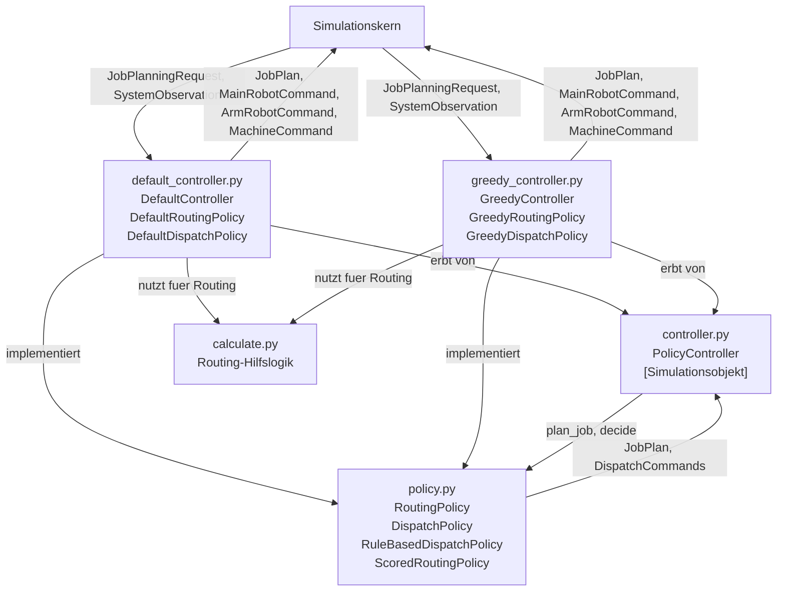

# SpineML

## Erweiterung des Simulationskerns

Im Projekt wurde der Simulationskern zunächst so erweitert, dass mehrere zuvor bereits konfigurierbare, aber im Laufzeitverhalten noch nicht wirksame Modellparameter direkt in die Simulation integriert werden.

### Zeitparameter auf Order-Ebene

Die Parameter `earliest_start_time` und `latest_end_time` aus `Order` wirken jetzt direkt im Ablauf der Simulation:

- `earliest_start_time`
  - bestimmt die Freigabe einer gesamten Order
  - Jobs einer Order werden erst ab diesem Zeitpunkt in das Startlager eingebracht
- `latest_end_time`
  - definiert den Soll-Fertigstellungszeitpunkt einer gesamten Order
  - nach Abschluss des letzten Jobs einer Order werden `completion_time`, `lateness` und `tardiness` berechnet

Damit werden Aufträge zeitlich nicht mehr sofort und implizit behandelt, sondern explizit über Release- und Due-Date-Logik modelliert.

### Speicher- und Pufferparameter

Die bisher nur in der Konfiguration vorhandenen Speicherparameter wirken nun ebenfalls im Simulationskern:

- `storage_capacity`
  - für `Layout`, `Corridor` und `Machine`
  - begrenzt die Kapazität der jeweiligen Stores
- `storage_in_time`
  - modelliert die Zeit für Einlagerungsvorgänge
- `storage_out_time`
  - modelliert die Zeit für Auslagerungsvorgänge

Dadurch entstehen erstmals reale Pufferbegrenzungen und zusätzliche Lagerzeiten im Materialfluss.

### Qualitätsparameter

Der Parameter `defect_probability` aus `OperationType` wurde in die Maschinenlogik integriert:

- nach einer Bearbeitung kann ein Job mit der angegebenen Wahrscheinlichkeit defekt werden
- defekte Jobs werden als Ausschuss markiert
- die weitere Bearbeitungsroute wird beendet
- der Ausschuss wird anschließend regulär aus dem System ausgeschleust

Damit wird Qualitätsunsicherheit erstmals explizit im Simulationskern abgebildet.

### Produktparameter

Auch zuvor ungenutzte Produktparameter wurden in Verhalten übersetzt:

- `weight`
  - beeinflusst die Bewegungsgeschwindigkeit beladener Roboter
- `length`, `width`, `depth`
  - beeinflussen zusätzliche dimensionsabhängige Bearbeitungszeit an Maschinen

Dadurch wirken Produkte nicht mehr nur als logische Typen, sondern auch über physische Eigenschaften auf den Simulationsablauf.

### Bedeutung der Erweiterung

Mit diesen Änderungen beschreibt der Simulationskern nicht mehr nur die Struktur des Spine-Layouts, sondern auch zentrale zeitliche, kapazitive, qualitative und produktspezifische Effekte.

Diese Erweiterung ist wichtig, weil spätere heuristische oder lernbasierte Steuerungsverfahren nur dann sinnvoll optimieren können, wenn die zugrunde liegende Simulation diese Einflussgrößen auch tatsächlich berücksichtigt.

## Erweiterung auf eine austauschbare Controller-Architektur

Auf Basis dieses erweiterten Simulationskerns wurde die Steuerungslogik von der eigentlichen Simulationslogik getrennt.
Ziel dieser Erweiterung ist es, unterschiedliche Steuerungsverfahren einsetzen zu können, ohne den Simulationskern für Roboter, Maschinen, Queues und Layouts jeweils neu anpassen zu müssen.

Die zentrale Idee ist:

- der Simulationskern beschreibt nur noch Zustände und Ausführung
- der Controller liest den Systemzustand periodisch ein
- die eigentliche Entscheidungslogik liegt in austauschbaren Policies
- Maschinen und Roboter führen nur noch die vom Controller erzeugten Commands aus

Damit entsteht eine klarere Schnittstelle zwischen Steuerung und Simulation und gleichzeitig eine Grundlage für spätere heuristische oder lernbasierte Verfahren.

### Strukturdiagramm: Aufbau von Simulation und Controller

Das folgende Diagramm zeigt die grobe Struktur zwischen Simulationskern, den abstrakten Policy-Schnittstellen in `policy.py`, den konkreten Policy-Implementierungen und den verdrahtenden Controller-Klassen.

`types.py` erscheint dabei nicht als eigener Knoten, weil dort keine aktive Logik ausgeführt wird. Die in `types.py` definierten Datentypen beschreiben die Schnittstelle zwischen Simulation, Controller und Policies.

## Überblick über die neue Struktur

Die Erweiterung konzentriert sich auf das Paket `sources/SpineML/controller/`.
Dort wurde die Steuerung in mehrere Bausteine aufgeteilt:

- `types.py`
- `calculate.py`
- `policy.py`
- `controller.py`
- `default_controller.py`
- `greedy_controller.py`

Zusätzlich wurde der Simulationskern im Ordner `sources/SpineML/Simulation/` so angepasst, dass Roboter und Maschinen ihre Entscheidungen nicht mehr selbst treffen, sondern Commands aus actor-spezifischen Command-Stores verarbeiten.

Der zentrale Architekturgedanke hinter den unterschiedlichen Controllern ist dabei:

- `calculate.py` erzeugt fuer das Routing den zulaessigen Suchraum
  - also moegliche Operationsfolgen und dazu passende Maschinenfolgen
- `RoutingPolicy` waehlt aus diesem Suchraum eine konkrete Route fuer einen Job aus
- `DispatchPolicy` waehlt waehrend der laufenden Simulation aus den aktuell moeglichen Aktionen die naechsten Commands aus
  - dieser dynamische Aktionsraum ist damit ein zweiter, laufend neu entstehender Suchraum

Damit ist die Aufgabenverteilung bewusst getrennt:

- `calculate.py` beantwortet die Frage:
  - welche Routing-Kandidaten sind im gegebenen Layout grundsaetzlich zulaessig?
- `RoutingPolicy` beantwortet die Frage:
  - welcher dieser zulaessigen Kandidaten soll fuer den aktuellen Job gewaehlt werden?
- `DispatchPolicy` beantwortet die Frage:
  - welche ausfuehrbare Aktion soll im aktuellen Simulationszustand als Naechstes erfolgen?
  - also welche aus der momentanen Queue-, Maschinen- und Roboterkonstellation ableitbare Aktion lokal am sinnvollsten ist

Genau darin unterscheiden sich `DefaultController` und `GreedyController`:

- beide nutzen dieselben Simulationsdaten und dieselbe Controller-Schnittstelle
- beide nutzen fuer das Routing dieselben in `calculate.py` erzeugten zulaessigen Kandidaten
- der Unterschied liegt in der Auswahlregel:
  - die Default-Policies bilden eine einfache Baseline
  - die Greedy-Policies bewerten Kandidaten heuristisch ueber Score-Funktionen und waehlen jeweils die lokal beste Alternative

Die eigentliche Optimierung liegt also nicht in der Erzeugung des Suchraums, sondern in der Bewertung und Auswahl innerhalb dieses Suchraums.
Fuer das Routing geschieht das einmalig pro Job, fuer das Dispatching fortlaufend waehrend der Simulation.

## Controller-Module

### `types.py`

`types.py` definiert die Datenschnittstelle zwischen Controller und Simulation.
Hier werden die Objekte beschrieben, mit denen der Controller arbeitet.
Die Typen sind dabei nicht auf einen bestimmten Controller zugeschnitten, sondern bilden den gemeinsamen Datenvertrag fuer `DefaultController`, `GreedyController` und spaetere weitere Steuerungsverfahren.

Dazu gehören insbesondere:

- `JobKey`
  - eindeutige Identifikation einer Produktionseinheit über Szenario, Order und Jobnummer
- `JobPlanningRequest`
  - Anfrage an die Routing-Logik für die Planung eines Jobs
- `JobPlan`
  - Ergebnis der Jobplanung mit `operation_sequence` und `machine_sequence`
- `JobHeadObservation`
  - detaillierte Beobachtung eines Jobs am Kopf einer Queue
  - enthaelt neben Produkt- und Routendaten inzwischen auch heuristisch relevante Informationen wie `is_defective`, `release_time`, `due_time`, `remaining_processing_time_estimate`, `slack_time` sowie aktuelle Produktparameter wie Gewicht und Abmessungen
- `QueueObservation`
  - Beobachtung einer Queue mit Laenge und Head-Job
  - enthaelt zusaetzlich `capacity` und `free_capacity`
- `OrderJobObservation`
  - detaillierte Beobachtung eines konkreten Jobs innerhalb einer Order
  - enthaelt zusaetzlich `released`, `completed`, `completion_time` und `defect_time`
- `SystemObservation`
  - vollständige Beobachtung des Systems aus Sicht des Controllers
- `DispatchCommand`
  - allgemeiner Command an einen Actor
- `MainRobotCommand`, `ArmRobotCommand`, `MachineCommand`
  - konkrete Commands für die jeweiligen Actoren

Diese Typen bilden die eigentliche Schnittstelle zwischen Simulationskern und Steuerungslogik.
Gleichzeitig stellen sie genau die Beobachtungen bereit, auf deren Basis spaeter heuristische oder lernbasierte Strategien Entscheidungen treffen koennen.

### `calculate.py`

`calculate.py` enthält die Logik zur Berechnung möglicher Operations- und Maschinenfolgen.
Diese Funktionen erzeugen den zulaessigen Suchraum fuer das Routing und werden von Routing-Policies genutzt.
Die eigentliche Auswahlentscheidung wird dabei bewusst nicht in `calculate.py` getroffen, sondern in der jeweils aktiven Routing-Policy.

Hier wird also berechnet:

- welche Operationsfolgen für ein Produkt möglich sind
- welche Maschinenfolgen für eine Operationsfolge im gegebenen Layout möglich sind

Sowohl `DefaultRoutingPolicy` als auch `GreedyRoutingPolicy` greifen damit auf dieselbe Menge zulaessiger Routing-Kandidaten zu.
Der Unterschied liegt nicht in der Erzeugung dieser Kandidaten, sondern in ihrer spaeteren Bewertung und Auswahl.

### `policy.py`

`policy.py` definiert die austauschbaren Steuerungsschnittstellen.
Die Datei enthaelt dabei bewusst nur die abstrakten Vertraege und gemeinsame Basisklassen, nicht aber konkrete Default- oder Greedy-Strategien.

Es gibt zwei zentrale Policy-Arten:

- `RoutingPolicy`
  - plant einen einzelnen Job beim Erzeugen
  - liefert ein `JobPlan`
- `DispatchPolicy`
  - entscheidet im laufenden Betrieb, welche Commands als Nächstes erzeugt werden sollen

Die Routing-Policies nutzen dabei die von `calculate.py` berechneten zulaessigen Alternativen und treffen daraus die eigentliche Auswahlentscheidung.
Damit liegt die Entscheidungslogik bewusst in `policy.py` und nicht im Simulationskern oder in den Hilfsfunktionen zur Kandidatenerzeugung.

Zusätzlich gibt es:

- `RuleBasedDispatchPolicy`
  - ein regelbasiertes Gerüst für Dispatching
  - zerlegt die Gesamtentscheidung in kleinere Teilentscheidungen:
    - `decide_main_robot_pick(...)`
    - `decide_main_robot_place(...)`
    - `decide_arm_robot_pick(...)`
    - `decide_arm_robot_place(...)`
    - `decide_machine_process(...)`

Damit muss eine neue Dispatch-Strategie nicht zwingend die gesamte Methode `decide(...)` selbst schreiben, sondern kann auf diesem Gerüst aufbauen.

Auf dieser Basis unterscheiden sich die konkreten Policies:

- die Default-Policies bilden eine einfache Baseline
- die Greedy-Policies bewerten Kandidaten heuristisch und waehlen jeweils die lokal beste Alternative

### `controller.py`

`controller.py` enthält den eigentlichen Laufzeit-Controller.

Die zentrale Klasse ist:

- `PolicyController`

`PolicyController` ist selbst eine `salabim.Component` und übernimmt die Vermittlung zwischen Simulation und Policies.

Seine Aufgaben sind:

- Speichern der aktiven `RoutingPolicy`
- Speichern der aktiven `DispatchPolicy`
- Beobachten aller relevanten Simulationsobjekte
- Umwandeln von Simulationszuständen in typed observations
- periodisches Aufrufen der Dispatch-Logik
- Verteilen der resultierenden Commands auf die jeweiligen Actoren

Wichtig ist dabei, dass `controller.py` selbst keine fachliche Routing- oder Dispatch-Entscheidung trifft.
Der Controller orchestriert nur den Ablauf zwischen Simulationskern und den aktuell eingesetzten Policies.
Dadurch koennen unterschiedliche Steuerungsverfahren eingesetzt werden, ohne den Controller oder den Simulationskern selbst umschreiben zu muessen.

Technisch wichtig ist dabei:

- jeder Actor besitzt einen eigenen `cmd_store`
- der Controller verwaltet eine Zuordnung `actor_id -> cmd_store`
- neue Commands werden über diese Zuordnung an den richtigen Actor geschickt

Der `PolicyController` enthält dafür insbesondere:

- Statusfunktionen für Jobs, Roboter und Maschinen
- `read_status()` zum Erzeugen eines `SystemObservation`
- `build_commands()` zum Aufruf der aktiven Dispatch-Policy
- `process()` als periodische Controller-Schleife

Die Schleife läuft konzeptionell so:

1. Systemzustand lesen
2. aktive Policy aufrufen
3. Commands erzeugen
4. Commands in die passenden `cmd_store`s legen
5. kurzes Intervall warten
6. erneut beginnen

### `default_controller.py`

`default_controller.py` enthält die erste konkrete Standardimplementierung.
In dieser Datei liegen neben `DefaultController` auch die konkreten Baseline-Implementierungen `DefaultRoutingPolicy` und `DefaultDispatchPolicy`.

Definiert wird hier:

- `DefaultRoutingPolicy`
- `DefaultDispatchPolicy`
- `DefaultController`

Die aktuelle Baseline arbeitet wie folgt:

- `DefaultRoutingPolicy`
  - bewertet zulaessige Operationsfolgen und Maschinenfolgen rein zufaellig
  - waehlt damit keine fachlich optimierte Route, sondern eine einfache Referenzloesung innerhalb des zulaessigen Suchraums
- `DefaultDispatchPolicy`
  - bewertet moegliche Pick-Aktionen fuer Main-Roboter und Arm-Roboter ebenfalls zufaellig
  - verwendet damit bewusst keine Prioritaeten bezueglich Due-Date, Stau, Restbearbeitungszeit oder Defektrisiko
  - bildet dadurch eine einfache Baseline fuer spaetere heuristische Vergleiche
- `DefaultController`
  - erbt von `PolicyController`
  - erzeugt standardmaessig eine `DefaultRoutingPolicy` und eine `DefaultDispatchPolicy`
  - uebergibt beide an den allgemeinen Controller
  - erlaubt bei Bedarf aber auch das Injizieren anderer Routing- und Dispatch-Policies

Damit ist eine lauffaehige Baseline vorhanden, ohne dass die eigentliche Entscheidungslogik im Controller selbst dupliziert werden muss.

### `greedy_controller.py`

`greedy_controller.py` enthält eine erste heuristische Variante der Steuerung.
Analog zu `default_controller.py` liegen in dieser Datei sowohl die heuristischen Policy-Implementierungen als auch der verdrahtende Controller.

Definiert wird hier:

- `GreedyRoutingPolicy`
- `GreedyDispatchPolicy`
- `GreedyController`

Dabei gilt:

- `GreedyRoutingPolicy`
  - bewertet moegliche Operations- und Maschinenfolgen ueber Score-Funktionen
  - bevorzugt kurze Bearbeitungszeiten, geringe Defektrisiken, wenige Korridorwechsel und kurze Transferwege
  - waehlt aus dem von `calculate.py` erzeugten Suchraum jeweils die lokal beste Route
- `GreedyDispatchPolicy`
  - bewertet moegliche naechste Aktionen im aktuell verfuegbaren Dispatch-Suchraum fuer Main-Roboter, Arm-Roboter und Maschinen
  - nutzt dafuer unter anderem `slack_time`, freie Zielkapazitaet, Restbearbeitungsdauer und verbleibende Bearbeitungsschritte
  - bevorzugt zusaetzlich das Leeren von `machine_out` und `corridor_main`, um Blockierungen zu reduzieren
  - laesst Bearbeitungsschritte fuer bereits defekte Jobs nicht mehr zu
- `GreedyController`
  - erbt von `PolicyController`
  - erzeugt standardmaessig eine `GreedyRoutingPolicy` und eine `GreedyDispatchPolicy`
  - übergibt beide an den allgemeinen Controller
  - erlaubt ebenso das Injizieren alternativer Policy-Instanzen

Damit steht neben der Standard-Baseline bereits eine erste austauschbare Greedy-Heuristik zur Verfügung.

## Benchmarking und Dashboard

Mit der Einfuehrung austauschbarer Controller reicht es nicht mehr aus, eine neue Strategie nur zu implementieren.
Sobald neben `DefaultController` auch weitere Varianten wie `GreedyController` existieren, stellt sich unmittelbar die Frage, ob diese Strategien unter gleichen Bedingungen tatsaechlich andere oder bessere Ergebnisse liefern.

Genau aus diesem Grund wurden zusaetzlich eine Benchmark-Schicht und ein Dashboard implementiert:

- unterschiedliche Controller sollen auf denselben Beispielen vergleichbar ausgefuehrt werden koennen
- Zufallseinfluesse sollen ueber gemeinsame Seeds kontrollierbar bleiben
- Ergebnisse sollen nicht nur beobachtet, sondern auch als Kennzahlen gespeichert und ausgewertet werden
- die Austauschbarkeit der Controller soll damit nicht nur architektonisch, sondern auch experimentell nachweisbar sein

Die Benchmarking-Schicht ermoeglicht damit den Uebergang von einer rein lauffaehigen Architektur zu einer auswertbaren Versuchsplattform fuer Baselines, Greedy-Heuristiken und spaetere weitere Verfahren.

### `benchmark.py`

`benchmark.py` enthaelt die eigentliche Benchmark-Logik.
Die Datei ist damit die fachliche Vergleichsschicht zwischen Simulationskern und den konkreten Auswertungswerkzeugen.

Ihre Aufgaben sind insbesondere:

- Laden von Beispielmodellen ueber `build_example()`
- Zuruecksetzen des globalen Konfigurationszustands zwischen Benchmark-Laeufen
- Erzeugen und Ausfuehren von Simulationslaeufen mit unterschiedlichen Controllerklassen
- Setzen gemeinsamer Seeds fuer faire und reproduzierbare Vergleiche
- Sammeln strukturierter Kennzahlen pro Run und pro Order
- Serialisieren der Ergebnisse in einen JSON-Report

Dabei werden unter anderem folgende Kennzahlen erfasst:

- `completed_jobs`, `completed_orders`
- `defective_jobs`
- `total_tardiness`, `average_tardiness`, `max_tardiness`
- `makespan`
- `throughput_jobs_per_time`
- `robot_utilization`, `machine_utilization`
- Queue-Laengen fuer Start, Ende, Corridor und Maschinenpuffer

Damit bildet `benchmark.py` die technische Grundlage fuer reproduzierbare Controller-Vergleiche.

### `benchmark_runner.py`

`benchmark_runner.py` ist die schlanke Kommandozeilen-Schnittstelle fuer die Benchmark-Schicht.
Die Datei dient dazu, Benchmark-Laeufe schnell auszufuehren, ohne den Python-Code jedes Mal manuell anpassen zu muessen.

Der Runner uebernimmt dabei:

- Auswahl von Beispielskripten
- Auswahl der zu vergleichenden Controller, z. B. `default` und `greedy`
- Uebergabe von Seeds
- Setzen einer optionalen Simulationsgrenze `till`
- Speichern des Reports als JSON-Datei
- kompakte Konsolenausgabe der wichtigsten Kennzahlen pro Run

Dadurch eignet sich `benchmark_runner.py` vor allem fuer:

- schnelle Vergleiche im Terminal
- wiederholbare Benchmark-Experimente
- das Erzeugen von JSON-Reports fuer spaetere Auswertung

### `benchmark_dashboard.py`

`benchmark_dashboard.py` stellt auf Basis von Streamlit eine grafische Oberflaeche fuer die Benchmark-Ergebnisse bereit.
Die Datei wurde implementiert, damit die Auswertung nicht nur ueber rohe JSON-Dateien oder Konsolenzeilen erfolgen muss.

Das Dashboard ermoeglicht:

- bestehende JSON-Reports zu laden
- neue Benchmark-Laeufe direkt aus der Oberflaeche zu starten
- Controller, Beispiele, Seeds und `till` interaktiv auszuwaehlen
- aggregierte Kennzahlen pro Controller zu vergleichen
- Run-Details und Order-Details tabellarisch anzuzeigen
- Reports erneut als JSON im Projektordner zu speichern oder herunterzuladen

Damit bildet das Dashboard die visuelle Auswertungsebene ueber der eigentlichen Benchmark-Logik.
Es ersetzt nicht den Benchmark selbst, sondern macht dessen Ergebnisse fuer Vergleiche und Analyse deutlich leichter nutzbar.
