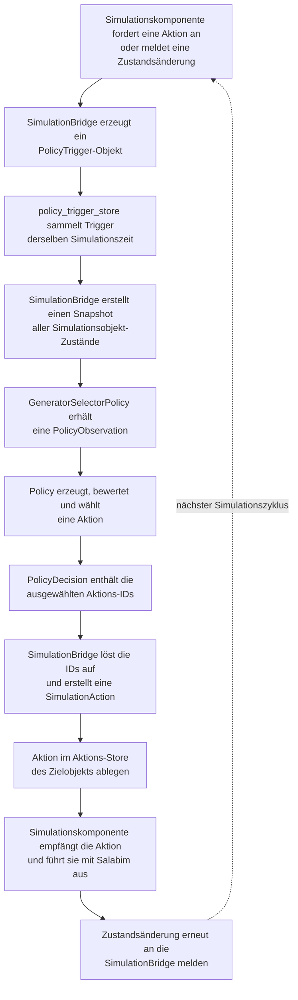
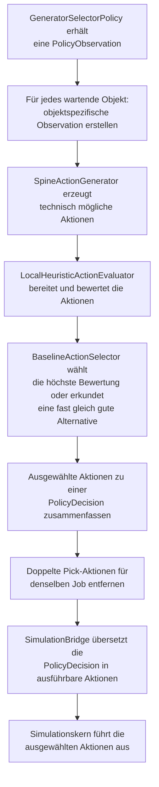
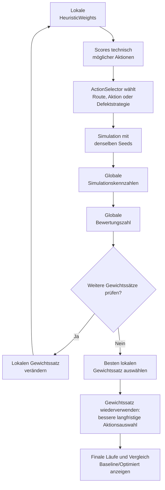

# Fabrikkonfiguration

In der Fabrikkonfiguration wurden zusätzliche Parameter für Lagerkapazitäten
und Maschinen ergänzt.

## Speicherkapazität des Layouts

Ein `Layout` besitzt eine eigene `storage_capacity`. Diese Kapazität gilt für
das Startlager und das Endlager des Layouts. Beispiel: Bei
`storage_capacity=10` kann jedes dieser Lager höchstens zehn Jobs aufnehmen.

`storage_capacity=10` bedeutet, dass Startlager und Endlager jeweils höchstens
zehn Jobs aufnehmen können.

## Getrennte Maschinenpuffer

Eine `Machine` erhält eine eigene Kapazität für den Eingangspuffer und eine
eigene Kapazität für den Ausgangspuffer. Für die Fräsmaschine A können zum
Beispiel `input_storage_capacity=10` und `output_storage_capacity=10`
konfiguriert werden.

Die beiden Werte werden unabhängig voneinander gespeichert. Dadurch kann der
Eingangspuffer eine andere Kapazität als der Ausgangspuffer besitzen.

## Erlaubte Werkzeugtypen einer Maschine

Mit `tool_types` kann festgelegt werden, welche Werkzeugtypen eine Maschine
verwenden darf. Für eine Maschine können beispielsweise `tool_type_1` und
`tool_type_2` erlaubt werden.

Wenn `tool_types` nicht angegeben wird, ermittelt die Maschine ihre
Werkzeugtypen automatisch aus den Operationen ihres `machine_type`.

## Grundwert der Verarbeitungsgeschwindigkeit

Eine Maschine enthält einen konfigurierten
`processing_speed_factor`. Der Standardwert ist `1.0`; dieser Wert kann direkt
bei der Maschine angegeben werden.

Der Wert gehört zur Fabrikkonfiguration und wird in der `Machine` gespeichert.
Die Erzeugung und Verwendung des effektiven Laufzeitfaktors erfolgt im
Simulationskern `SimMachine`.

## Schutzwerkzeugzeiten

Das Schutzwerkzeug (`dummy_tool`) ist ein Platzhalterwerkzeug der Maschine.
Es ist kein Produktionswerkzeug. Die Maschine startet damit in einem
definierten Zustand. Vor der ersten Bearbeitung wird es entfernt und das
benötigte Produktionswerkzeug montiert. Nach dem Simulationslauf wird das
Produktionswerkzeug wieder entfernt und das Schutzwerkzeug montiert.

Für jede Maschine werden beim Erzeugen intern die Standardzeiten
`dummy_tool_mount_time=1.0` und `dummy_tool_unmount_time=1.0` für das
Schutzwerkzeug angelegt.

Diese Werte werden bei der Montage beziehungsweise Demontage des
Schutzwerkzeugs verwendet. Sie sind derzeit keine zusätzlichen Argumente des
`Machine`-Konstruktors.

Das Schutzwerkzeug sorgt dafür, dass jede Maschine zu Beginn und am Ende
einen eindeutig definierten Werkzeugzustand besitzt. Ohne diesen Platzhalter
müsste die Maschine mit `tool_type = None` starten und beendet werden. Für die
Produktionsplanung ist das Schutzwerkzeug nicht zwingend erforderlich; es
modelliert den vollständigen Werkzeuglebenszyklus einschließlich Montage und
Demontage.

# Diskrete Simulation

Die Laufzeitkomponenten führen die Aktionen der Steuerung aus. Die
Simulationskomponenten planen keine Produktionsroute selbst. Sie melden ihren
Zustand, fordern eine Aktion an und führen die zurückgegebene Aktion aus.

## Laufzeit-Stores und Kapazitäten

Beim Erzeugen des Laufzeitlayouts werden die konfigurierten Kapazitäten an die
Salabim-Stores weitergegeben:

- Start- und Endlager verwenden `layout.storage_capacity`.
- Jeder Korridor erzeugt `store_main`, `store_left` und `store_right` mit
  `corridor.storage_capacity`.
- Jede Maschine erzeugt einen Eingangsstore mit
  `machine.input_storage_capacity` und einen Ausgangsstore mit
  `machine.output_storage_capacity`.

Die Ein- und Auslagerungszeiten werden bei den Roboteraktionen als
Simulationszeit berücksichtigt. Vor beziehungsweise nach dem Ablegen oder
Entnehmen wartet der zuständige Roboter die konfigurierte Zeit.

## Laufzeitstatus eines Jobs

Jeder `SimOrderJob` besitzt einen beobachtbaren Laufzeitstatus. Nicht alle
Attribute werden von der Steuerung gesetzt: Einige entstehen direkt durch ein
Simulationsereignis, andere werden aus einer Aktion übernommen.


| Attribut                      | Bedeutung                                                                                    | Umsetzung im Simulationskern und Quelle der Eingabe                                                                                                                                            | Warum wird es benötigt?                                                                                |
| ------------------------------- | ---------------------------------------------------------------------------------------------- | ------------------------------------------------------------------------------------------------------------------------------------------------------------------------------------------------ | --------------------------------------------------------------------------------------------------------- |
| `released`                    | Gibt an, ob der Job bereits für die Produktion freigegeben wurde.                           | `SimOrderJob` übernimmt `released` aus der `release_job`-Aktion und speichert den Wert. Die Freigabeauswahl kommt aus der Steuerung.                                                          | Ein Job darf erst nach seiner Freigabe weiterlaufen.                                                    |
| `queue_priority`              | Priorität beim Einfügen des Jobs in einen Salabim-Store.                                   | Die Steuerung liefert die Priorität im Pick-Payload. Simulationsroboter und Maschine übernehmen sie und verwenden sie beim`to_store(...)`.                                                   | Jobs werden in einer Warteschlange nach der vorgegebenen Priorität behandelt.                          |
| `completed_time`              | Tatsächlicher Zeitpunkt, zu dem der Job abgeschlossen wurde.                                | `SimRobotMain` ruft beim Ablegen im Endlager `mark_finished()` auf; der Simulationskern speichert `env.now()`.                                                                                 | Grundlage für Terminstatus, Tardiness und Makespan.                                                    |
| `process_finished`            | Gibt an, ob der Jobprozess beendet werden darf.                                              | `SimOrderJob` setzt das Flag, wenn die Aktion `finish_process=True` enthält. `SimCompletionWatcher` liest es.                                                                                 | Der Jobprozess kann beendet und die Simulation automatisch gestoppt werden.                             |
| `location`                    | Aktueller Aufenthaltsort des Jobs, zum Beispiel Store oder Roboter.                          | Die Laufzeitobjekte aktualisieren den Ort nach Pick und Place. Der Zielort wird von der Steuerungsaktion vorgegeben.                                                                           | Der Aufenthaltsort wird der nächsten Beobachtung bereitgestellt.                                       |
| `selected_operation`          | Nächste ausgewählte Operation.                                                             | `SimOrderJob` übernimmt die Operation aus dem Aktions-Payload und speichert sie; die Steuerung liefert die Auswahl.                                                                           | Die Maschine weiß, welche Operation ausgeführt werden soll.                                           |
| `selected_machine`            | Maschine für die ausgewählte nächste Operation.                                           | `SimOrderJob` übernimmt die Maschine aus dem Aktions-Payload und speichert sie; die Steuerung liefert die Auswahl.                                                                            | Transport und Bearbeitung werden zu dieser Maschine geführt.                                           |
| `bearbeitungs_state`          | Aktueller Produktzustand, zum Beispiel`unconfigured` oder ein Produkttyp.                    | Der Simulationskern initialisiert`unconfigured`, übernimmt bei Recovery den im Payload angegebenen Ausgangszustand und setzt nach erfolgreicher Bearbeitung den erzeugten Produkttyp.         | Die weitere Produktionsroute hängt vom aktuellen Produktzustand ab.                                    |
| `general_state`               | Aktueller Qualitäts- und Produktionsstatus:`intakt`, `defect` oder `ausschuss`.             | Der Simulationskern initialisiert`intakt`, setzt bei `mark_defective()` auf `defect`, setzt nach erfolgreicher Bearbeitung wieder `intakt` und übernimmt `ausschuss` aus der Ausschussaktion. | Der Status bestimmt, welcher nächste Aktionspfad beobachtet werden kann.                               |
| `due_state`                   | Terminstatus, zum Beispiel`on-time` oder `late`.                                             | `SimOrderJob` übernimmt den von der Steuerung berechneten Wert aus der Abschlussaktion.                                                                                                       | Der einzelne Job erhält seinen Terminstatus.                                                           |
| `downgraded`                  | Gibt an, ob das Produkt herabgestuft wurde.                                                  | `SimOrderJob` übernimmt das Flag aus der Herabstufungsaktion. Die Entscheidung und der Wert im Payload kommen aus der Steuerung.                                                              | Herabgestufte Jobs dürfen nicht mehr die normale Zielroute verwenden.                                  |
| `downgrade_product_type`      | Produktzustand, auf den ein Job herabgestuft wurde.                                          | `SimOrderJob` speichert den Produktzustand aus der Herabstufungsaktion.                                                                                                                        | Der neue Produktzustand bestimmt die weitere Behandlung.                                                |
| `defect_detected_time`        | Zeitpunkt der Defekterkennung.                                                               | `SimOrderJob.mark_defective()` speichert `env.now()` des Simulationskerns.                                                                                                                     | Der Defektzeitpunkt bleibt für Diagnose und Auswertung erhalten.                                       |
| `defect_operation`            | Operation, die den Defekt verursacht hat.                                                    | `SimMachine` übergibt die gerade ausgeführte Operation an `mark_defective()`, das sie im Job speichert.                                                                                      | Die historische Defektursache bleibt bekannt.                                                           |
| `defect_machine`              | Maschine, auf der der Defekt entstanden ist.                                                 | `SimMachine` übergibt sich selbst an `mark_defective()`, das die Maschine im Job speichert.                                                                                                   | Die historische Defektmaschine wird für Recovery und Kennzahlen benötigt.                             |
| `defect_product_state_before` | Produktzustand vor der fehlerhaften Operation.                                               | `SimMachine` speichert den `consumes_product_type` der ausgeführten Operation über `mark_defective()`.                                                                                       | Die Nacharbeit startet wieder bei diesem Zustand, zum Beispiel bei Produkt A.                           |
| `defect_product_state_target` | Produktzustand, den die fehlerhafte Operation erzeugen sollte.                               | `SimMachine` speichert den `produces_product_type` der ausgeführten Operation über `mark_defective()`.                                                                                       | Nach erfolgreicher Nacharbeit soll dieser Zielzustand wieder erreicht werden, zum Beispiel Produkt B.   |
| `defekt_schwergrad`           | Schweregrad des Defekts im Bereich von`0.0` bis `1.0`.                                       | `SimMachine` erzeugt ihn mit einem aus Simulations-Seed und Jobdaten abgeleiteten `quality_rng` und speichert ihn bei einem Defekt.                                                            | Bei`0.001` bis `<0.6` kann die Steuerung Nacharbeit anbieten; ab `0.6` bleibt nur Ausschuss.            |
| `defect_recovery_strategy`    | Ausgewählte Strategie, zum Beispiel Nacharbeit oder Ausschuss.                              | `SimOrderJob` speichert die Strategie aus dem Aktions-Payload; bei einem neuen Defekt löscht `mark_defective()` die alte Strategie. Die Auswahl kommt aus der Steuerung.                      | Die nächste Simulation beobachtet, welche Defektbehandlung aktiv ist.                                  |
| `recovery_in_progress`        | Gibt an, dass eine ausgewählte Recovery-Strategie noch transportiert oder ausgeführt wird. | `SimOrderJob` setzt es beim Empfang einer Nacharbeitsaktion auf `True`. `SimMachine` setzt es nach der Nacharbeitsbearbeitung auf `False`.                                                     | Verhindert eine neue Recovery-Entscheidung, solange die laufende Recovery noch nicht abgeschlossen ist. |
| `defect_count`                | Anzahl erkannter Defekte dieses Jobs.                                                        | `mark_defective()` erhöht den Zähler im Simulationskern.                                                                                                                                     | Wird für Qualitätskennzahlen und Diagnosen gezählt.                                                  |
| `nacharbeit_count`            | Anzahl ausgelöster Nacharbeitsaktionen.                                                     | `SimOrderJob` erhöht den Zähler, wenn eine Nacharbeitsaktion ausgeführt wird.                                                                                                               | Wird für Kennzahlen und den nächsten Quality-Key verwendet.                                           |
| `ausschuss_count`             | Anzahl der Ausschussentscheidungen.                                                          | `SimOrderJob` erhöht den Zähler, wenn eine `job_ausschuss`-Aktion ausgeführt wird.                                                                                                          | Wird als globale Qualitätskennzahl ausgewertet.                                                        |

## Simulationsobjekte: Aktionen, Ausführung und Zustandsmeldungen

### `SimOrderJob` (Job)

- **Aktionen der Steuerung:** `release_job`, `wait_job`,
  `job_nacharbeiten_auf_defektmaschine`,
  `job_nacharbeiten_auf_alternativer_maschine`, `produkt_herabstufen`,
  `job_ausschuss` und `complete_job`.
- **Simulationskern:** Übernimmt die Payload-Werte, aktualisiert den Jobstatus
  und legt sich bei `release_job` einmalig in den Startstore. Pick und Place
  übernimmt danach ein Roboter; der Job wählt keine Route selbst.
- **Seed/Reproduzierbarkeit:** Der Job verwendet keinen eigenen Zufall.
  Qualitätszufälle entstehen erst bei `SimMachine`.
- **Zustandsmeldung:** Meldet Änderungen an Freigabe, Produkt-/Qualitätsstatus,
  Recovery und Abschluss über die Bridge; `finish_process=True` beendet den
  Jobprozess.

### `SimRobotMain` und `SimRobotCorridorArm` (Roboter)

- **Aktionen der Steuerung:**
  - Main-Roboter: `pick_main_robot`, `place_main_robot`, `wait_main_robot`.
  - Korridorarm: `pick_corridor_arm_robot`, `place_corridor_arm_robot`,
    `wait_corridor_arm_robot`.
- **Simulationskern:** Führt den Transport des im Payload ausgewählten Jobs
  aus. Die Roboter wählen keinen Ersatzjob und keine neue Route. Die feste
  Grundgeschwindigkeit beträgt `2.0` (Main) beziehungsweise `1.5` (Arm).
- **Seed/Reproduzierbarkeit:** Pro Roboter wird ein Faktor aus `0.95` bis
  `1.05` erzeugt. Die effektive Geschwindigkeit berechnet sich als
  `Grundgeschwindigkeit × Zufallsfaktor`. Dadurch sind effektive Geschwindigkeit
  und Bewegungsdauer für X, Y und Z bei gleichem Seed reproduzierbar.
- **Zustandsmeldung:** Nach Pick und Place werden Jobstandort, Beladung und
  Roboterzustand über die Bridge gemeldet. Beim Ablegen im Endlager wird
  außerdem `completed_time` gesetzt.

### `SimMachine` (Maschine)

- **Aktionen der Steuerung:** `pick_machine_job`, `process_machine_job` und
  `wait_machine`; Operation, Werkzeug und Lebensdauerwerte kommen im Payload.
- **Simulationskern:** Führt genau die ausgewählte Operation aus, berechnet
  ihre Dauer, führt Werkzeugwechsel und Lebensdauerverbrauch aus und prüft den
  Ausgangspuffer. Die Maschine wählt weder Job noch Operation selbst.
- **Seed/Reproduzierbarkeit:** Die Laufzeitvariation ist ein Zufallsfaktor für
  die Bearbeitungsdauer. Bei gleicher Konfiguration und gleichem Seed entsteht
  daher dieselbe Bearbeitungsdauer.

  Unabhängig davon entscheidet die Qualitätsprüfung zuerst, ob ein Defekt
  entsteht, und erzeugt bei einem Defekt zusätzlich den `defekt_schwergrad`.
  Bei gleicher Konfiguration und gleichem Seed entstehen daher dieselben
  Defekte und dieselben Schweregrade.

  ```python
  defekt = quality_rng.random() < operation.defect_probability; defekt_schwergrad = quality_rng.random() if defekt else None
  ```
- **Zustandsmeldung:** Meldet `waiting` (bereit), `working` (Bearbeitung) und
  `blocked` (der Ausgangspuffer kann den fertigen Job nicht aufnehmen) sowie
  die fertige Ablage. Bei einem Defekt speichert sie Schweregrad, Operation,
  Maschine und Produktzustände im Job und meldet die Änderung über die Bridge.

## Werkzeuglebensdauer und Schutzwerkzeug

Die Steuerung verwendet für die Maschine die Aktionstypen
`pick_machine_job`, `process_machine_job` und `wait_machine`. In der
`process_machine_job`-Payload steht zusätzlich `tool_setup_action`:
`keep_tool`, `unmount_dummy_tool_and_mount_tool`, `unmount_and_mount_tool` oder
`replace_tool_same_type`.

`SimMachine` führt diese Werkzeugaktion aus, verbraucht während der Operation
`consumed_life_units` und aktualisiert danach
`remaining_life_units`. Montage, Demontage und Werkzeugwechsel benötigen dabei
Simulationszeit.

Am Ende des Simulationslaufs kann der optionale Abschlussprozess
`SimMachineShutdown` ein noch montiertes Produktionswerkzeug entfernen und
wieder das Schutzwerkzeug montieren. Dieser Prozess gehört nicht zur normalen
Jobbearbeitung; damit endet die Maschine in einem definierten Werkzeugzustand.

## Automatisches Simulationsende

`SimScenario` erstellt beim Aufbau des Szenarios den
`SimCompletionWatcher`. Der Watcher ist eine Salabim-`sim.Component`; seine
`process()`-Methode läuft als Simulationsprozess. Sie sammelt einmalig alle
Jobs aus den erzeugten Aufträgen und prüft regelmäßig, ob jeder Job das Flag
`process_finished=True` besitzt. Das Flag wird durch eine Abschlussaktion mit
`finish_process=True` gesetzt. Sobald alle Jobs abgeschlossen sind, löst der
Watcher `sim.SimulationStopped` aus. Der Simulationsrunner fängt dieses Signal
ab und sammelt anschließend die globalen Kennzahlen.

# SimulationBridge

Jobs, Maschinen, der Main-Roboter und die Korridorarm-Roboter sind an die
`SimulationBridge` angeschlossen. Der wiederkehrende Ablauf einer
Simulationskomponente besteht darin, mit `request_action(self)` eine Aktion
anzufordern und anschließend mit `action(self)` die ausgewählte Aktion zu
empfangen.

Die Bridge trennt die für die Policy sichtbaren IDs von den echten
Salabim-Komponenten:

- Die Policy arbeitet mit IDs für Jobs, Maschinen, Operationen, Werkzeuge und
  Stores. Sie erhält keine direkten Simulationsobjekte.
- Bei der Registrierung ordnet die Bridge jeder Policy-ID genau eine
  Simulationskomponente zu und erstellt für diese Komponente einen eigenen
  Aktions-Store.
- Eine Policy-Aktion enthält ebenfalls nur IDs. Die Bridge löst diese IDs in
  die echten Simulationsobjekte und Stores auf und legt die ausführbare Aktion
  nur im Aktions-Store des Zielobjekts ab.
- Eine Zustandsänderung ruft `notify_state_change(self)` auf. Dabei erzeugt die
  Bridge ein internes `PolicyTrigger`-Objekt mit Sender-ID, Simulationszeit
  und Zustandsversion und legt es in den zentralen `policy_trigger_store`.
- Die Bridge ist selbst eine Salabim-`sim.Component`. Ihre `process()`-Methode
  wartet auf diesen Store, sammelt weitere Trigger derselben Simulationszeit
  und löst anschließend die Erstellung eines Snapshots aus. Der Snapshot
  bildet den aktuellen Zustand aller registrierten Simulationsobjekte für die
  Policy ab. Die Triggerobjekte selbst werden nicht an die Policy übergeben;
  ihre Ereignis- und Sender-IDs können nur als Metadaten in der Observation
  enthalten sein.
- Die Bridge ruft danach die Policy mit einer `PolicyObservation` auf. Die
  Policy liefert eine `PolicyDecision` mit ausgewählten Aktionen und IDs.
  Die Bridge löst diese IDs in echte Simulationsobjekte auf und legt jede
  ausführbare `SimulationAction` im persönlichen Aktions-Store des jeweiligen
  Zielobjekts ab.

Das gilt für jede Simulationskomponente: Sie meldet ihren aktuellen Zustand,
wartet auf die Entscheidung der Steuerung, führt diese Entscheidung mit
Salabim aus und meldet danach die Zustandsänderung wieder an die Bridge. Die
Simulation wählt dabei keine Ersatzaktion und keine Produktionsroute selbst.

Der Ablauf zwischen Bridge, Steuerung und Simulationskomponenten ist:


```mermaid
flowchart TD
    A[Simulationskomponente fordert eine Aktion an<br/>oder meldet eine Zustandsänderung]
    A --> B[SimulationBridge erzeugt ein<br/>PolicyTrigger-Objekt]
    B --> C[policy_trigger_store sammelt Trigger<br/>derselben Simulationszeit]
    C --> D[SimulationBridge erstellt einen Snapshot<br/>aller Simulationsobjekt-Zustände]
    D --> E[GeneratorSelectorPolicy erhält<br/>eine PolicyObservation]
    E --> F[Policy erzeugt, bewertet und wählt<br/>eine Aktion]
    F --> G[PolicyDecision enthält die<br/>ausgewählten Aktions-IDs]
    G --> H[SimulationBridge löst die IDs auf<br/>und erstellt eine SimulationAction]
    H --> I[Aktion im Aktions-Store<br/>des Zielobjekts ablegen]
    I --> J[Simulationskomponente empfängt die Aktion<br/>und führt sie mit Salabim aus]
    J --> K[Zustandsänderung erneut an die<br/>SimulationBridge melden]
    K -. nächster Simulationszyklus .-> A
```

Als `Simulationskomponente` treten dabei `SimOrderJob`, `SimMachine`,
`SimRobotMain` und `SimRobotCorridorArm` auf. Jede Komponente durchläuft diesen
Ablauf unabhängig; die Bridge gibt die Aktion nur an die jeweils anfragende
Komponente zurück.

# GeneralControl

`GeneralControl` wird sowohl bei einem normalen Simulationslauf als auch bei der Optimierung verwendet.

## Ablauf der GeneralControl


```mermaid
flowchart TD
    A[GeneratorSelectorPolicy erhält<br/>eine PolicyObservation]
    A --> B[Für jedes wartende Objekt:<br/>objektspezifische Observation erstellen]
    B --> C[SpineActionGenerator erzeugt<br/>technisch mögliche Aktionen]
    C --> D[LocalHeuristicActionEvaluator<br/>bereitet und bewertet die Aktionen]
    D --> E[BaselineActionSelector wählt<br/>die höchste Bewertung oder erkundet<br/>eine fast gleich gute Alternative]
    E --> F[Ausgewählte Aktionen zu einer<br/>PolicyDecision zusammenfassen]
    F --> G[Doppelte Pick-Aktionen für<br/>denselben Job entfernen]
    G --> H[SimulationBridge übersetzt die<br/>PolicyDecision in ausführbare Aktionen]
    H --> I[Simulationskern führt die<br/>ausgewählten Aktionen aus]
```

## GeneratorSelectorPolicy

Aus Sicht der Simulation ist `GeneratorSelectorPolicy` die Policy. Sie ist
hauptsächlich eine Hülle: Die eigentliche Aktionslogik liegt in drei
austauschbaren Bausteinen, die sie miteinander verbindet:

- `ActionGenerator` erzeugt aus der Beobachtung die technisch möglichen
  Aktionen für das aktuell betrachtete wartende Simulationsobjekt.
- `ActionEvaluator` bewertet diese Aktionen anhand gewichteter
  Dispatching-Regeln, zum Beispiel EDD-Termindruck, Queue-Priorität,
  Transportzeit, Bearbeitungszeit, Werkzeugzustand und Defekt-Recovery.
- `ActionSelector` wählt normalerweise die Aktion mit dem höchsten Score aus.
  Der `BaselineActionSelector` kann gelegentlich auch eine fast gleich gute
  Alternative zur Exploration auswählen.

Die Policy prüft im Snapshot, welche Simulationskomponenten auf eine Aktion
warten. Für jedes wartende Objekt erstellt sie eine objektspezifische
`PolicyObservation`, lässt mögliche Aktionen erzeugen, bewerten und auswählen
und sammelt die Ergebnisse in einer `PolicyDecision`. Doppelte Pick-Aktionen
für denselben Job werden anschließend entfernt.

Bei einem normalen Simulationsstart ohne Optimierung verwendet die Hülle
`SpineActionGenerator`, `BaselineActionSelector` und
`LocalHeuristicActionEvaluator` mit einem festen `HeuristicWeights`-Satz.

### Ablauf von `make_decision()`

1. Die Policy liest aus dem Snapshot alle Simulationskomponenten, die auf eine
   Aktion warten.
2. Für jedes wartende Objekt wird eine eigene `PolicyObservation` mit seiner
   `current_object_id` erstellt.
3. `ActionGenerator` erzeugt die technisch möglichen Aktionen dieses Objekts.
4. `ActionSelector` lässt diese Kandidaten durch den `ActionEvaluator` bewerten
   und wählt normalerweise die Aktion mit dem höchsten Score aus.
5. Die ausgewählten `SelectedObjectAction`-Objekte werden zu einer
   `PolicyDecision` zusammengefasst und an die Bridge zurückgegeben.
6. Ein Job darf nicht gleichzeitig von mehreren Pick-Aktionen ausgewählt
   werden; solche doppelten Picks entfernt die Policy vor der Rückgabe.

## ActionGenerator

`SpineActionGenerator.generate_actions()` erzeugt für ein einzelnes wartendes
Simulationsobjekt eine Liste technisch möglicher Aktionen. Die Generierung
erfolgt in zwei Schritten: zuerst einfache Zustandsregeln, danach die
Erzeugung mehrerer Kandidaten für die zutreffende Situation.

### Einfache Zustandsregeln

`_generate_actions()` prüft zuerst den Typ und den aktuellen Zustand des
Objekts. Die Verzweigung für einen Job entspricht dabei dieser Reihenfolge:

**Job:**

- `completed_time` vorhanden und `due_state` noch nicht gesetzt
  - `complete_job` (Beispiel: Der Job liegt im Endlager und erhält
    `finish_process=True`.)
- `general_state == "defect"`
  - `recovery_in_progress == True` → nur `wait_job`.
  - Nacharbeit technisch nicht möglich → nur `job_ausschuss`.
  - Nacharbeit technisch möglich → mehrere mögliche Recovery-Aktionen und
    `wait_job`.
- `released == False`
  - `release_job` und zusätzlich `wait_job`.
- Alle anderen Jobzustände
  - `wait_job`.

Für Roboter und Maschinen gelten einfache Zustandsregeln:

**Main-Roboter oder Korridorarm:**

- `current_job_id == None` → Pick-Kandidaten.
- `current_job_id != None` → Place-Kandidaten.

**Maschine:**

- `current_job_id == None` → Pick-Kandidaten.
- `current_job_id != None` und Ausgangspuffer hat Kapazität →
  `process_machine_job`.
- `current_job_id != None` und Ausgangspuffer ist voll → `wait_machine`.

Diese Regeln schränken den Lösungsraum ein: Fehlende Kapazität, ungültige
Routen oder nicht verfügbare Maschinen erzeugen keinen Aktionskandidaten.

### Mehrere Kandidaten pro wartendem Objekt

Wenn die Zustandsregel mehrere Möglichkeiten zulässt, erzeugt der Generator
alle diese Kandidaten gleichzeitig in einer Liste. „Gleichzeitig“ bedeutet
hier dieselbe Auswahlrunde, nicht parallele Ausführung in der Simulation. Der
`ActionSelector` bewertet anschließend die gesamte Liste und wählt genau eine
Aktion aus.
Die folgenden Payloads zeigen jeweils nur ein Beispiel aus dieser Liste; die
Kandidaten werden gemeinsam erzeugt, aber nicht gemeinsam ausgeführt.

**Defekter Job mit technisch möglicher Nacharbeit:**

1. `job_nacharbeiten_auf_defektmaschine` (wenn die Defektmaschine verfügbar
   ist).
2. `job_nacharbeiten_auf_alternativer_maschine` (für jede gefundene
   Alternativroute).
3. `produkt_herabstufen`.
4. `wait_job`.

Wenn Nacharbeit technisch nicht möglich ist, wird stattdessen ausschließlich
`job_ausschuss` erzeugt.

Beispiel für eine Herabstufungsaktion:

```json
{
  "action_type": "produkt_herabstufen",
  "payload": {
    "selected_operation_id": null,
    "selected_machine_id": null,
    "bearbeitungs_state": "produkt_b",
    "general_state": "intakt",
    "downgraded": true,
    "downgrade_product_type_id": "produkt_b",
    "defect_recovery_strategy": "herabstufen"
  }
}
```

**Pick:**

1. Eine eigene `pick_*`-Aktion für jeden auswählbaren Job im Store (Beispiel:
   zwei Jobs erzeugen zwei Pick-Kandidaten).
2. Zusätzlich eine `wait_*`-Aktion.

Beispiel für eine Pick-Aktion des Main-Roboters:

```json
{
  "action_type": "pick_main_robot",
  "payload": {
    "target_type": "start_storage",
    "target_store_id": "start",
    "selected_job_id": "auftrag_1:1",
    "storage_out_time": 1.0
  }
}
```

**Place:**

1. Eine eigene `place_*`-Aktion für jede technisch mögliche Route und jeden
   freien Zielstore (Beispiel: zwei freie Zielrouten erzeugen zwei
   Place-Kandidaten).
2. Zusätzlich eine `wait_*`-Aktion.

Beispiel für eine Place-Aktion des Main-Roboters:

```json
{
  "action_type": "place_main_robot",
  "payload": {
    "target_type": "sim_corridor_store_arm_input",
    "selected_operation_id": "operation_1",
    "selected_machine_id": "machine_1",
    "sim_corridor_id": "corridor_1",
    "target_store_id": "corridor_1_left",
    "storage_in_time": 1.0
  }
}
```

**Maschine:**

1. Eine eigene `pick_machine_job`-Aktion für jeden auswählbaren Job im
   Eingangspuffer.
2. Für einen geladenen Job `process_machine_job` bei freiem Ausgangspuffer;
   bei fehlender Kapazität `wait_machine` (Beispiel: voller Ausgangspuffer).

Beispiel für eine Bearbeitungsaktion:

```json
{
  "action_type": "process_machine_job",
  "payload": {
    "operation_id": "operation_1",
    "planned_machine_id": "machine_1",
    "tool_type_id": "tool_1",
    "total_life_units": 100,
    "consumed_life_units": 5,
    "remaining_life_units_before_operation": 80,
    "tool_setup_action": "keep_tool",
    "target_store_id": "machine_1_out"
  }
}
```

Die Hilfsmethoden lesen dafür den aktuellen Snapshot, das ID-basierte
Konfigurationsmodell, Store-Kapazitäten und mögliche Operations- und
Maschinenrouten. `generate_actions()` entfernt danach nur exakt doppelte
Kandidaten. Damit ist gemeint: gleicher `action_type` und gleicher Payload.
Unterschiedliche Routen oder Zielstores bleiben erhalten. Erst anschließend
übernimmt der `ActionSelector` die Bewertung und Auswahl.

## ActionSelector

Der `ActionSelector` erhält die gesamte Kandidatenliste eines wartenden
Objekts. Er erzeugt keine neuen Aktionen, sondern lässt jeden Kandidaten vom
`ActionEvaluator` vorbereiten und bewerten. Der Standard-
`BaselineActionSelector` arbeitet dabei in folgenden Schritten:

1. Gibt es für das wartende Objekt keine Aktion, gibt er eine leere
   `PolicyDecision` zurück.
2. Für jede vorhandene Aktion ergänzt der `ActionEvaluator` zunächst die
   benötigten Payload-Werte und berechnet danach ihren Score.
3. Der höchste Score wird gesucht. Alle Aktionen mit genau diesem Score gelten
   als beste Aktionen.
4. Zusätzlich gelten Aktionen als fast gleich gut, wenn ihr Score höchstens
   `0.05` unter dem höchsten Score liegt. Bei einem Höchstwert von `0.80`
   werden zum Beispiel auch Aktionen ab `0.75` als fast gleich gut gesammelt.
5. **Exploration:** Exploration bedeutet, gelegentlich bewusst nicht die
   aktuell beste Aktion zu verwenden, sondern eine fast gleich gute Alternative
   auszuprobieren. Mit `EXPLORATION_EPSILON = 0.10` geschieht das mit einer
   Wahrscheinlichkeit von `10 %`. Wenn möglich, wird dabei eine ausführbare
   Aktion statt einer reinen Warteaktion verwendet. So können andere
   Produktionswege getestet werden, ohne deutlich schlechtere Aktionen zu
   wählen.
   Diese Exploration betrifft nur die Aktionsauswahl während eines
   Simulationslaufs. Sie verändert keine lokalen Gewichtssätze, kann aber den
   weiteren Simulationsverlauf und dadurch die globalen Kennzahlen beeinflussen.
   Das ist bei der Optimierung nützlich, weil dadurch auch fast gleich gute
   Produktionsentscheidungen ausprobiert werden und sich die Simulation nicht
   dauerhaft auf eine möglicherweise ungünstige lokale Aktionswahl festlegt.
   Die Verwendung derselben
   Seeds und die Mittelung über mehrere Seeds halten diesen Einfluss
   reproduzierbar und vergleichbar.
   Die Exploration verändert dabei keine Scores und keine Gewichte. Ob zum
   Beispiel `job_nacharbeiten_auf_defektmaschine` gegenüber
   `job_nacharbeiten_auf_alternativer_maschine` bevorzugt wird, entscheidet die
   normale Score-Berechnung aus den lokalen Teilwertgewichten.
6. **Keine Exploration:** In den übrigen Fällen wählt der Selector zufällig
   eine der exakt besten Aktionen. Diese Zufallsauswahl löst nur Gleichstände
   auf und bleibt mit demselben Simulations-Seed reproduzierbar.

Die ausgewählte Aktion wird anschließend als `PolicyDecision` für das
Zielobjekt an die `GeneratorSelectorPolicy` zurückgegeben.

# HeuristicControl

„Heuristisch“ bedeutet, dass eine praktische Näherungsregel verwendet wird,
um schnell eine gute Entscheidung zu finden. `HeuristicControl` bewertet die
vom `ActionGenerator` erzeugten Aktionskandidaten. Es erzeugt keine neuen
Aktionen und führt keine Aktion in der Simulation aus. Es berechnet nur für
jeden Kandidaten einen Score, damit der `ActionSelector` die Kandidaten
vergleichen kann.

Der Name beschreibt damit seine Rolle: Es ist ein Kontrollteil der Policy,
der die aktuelle Auswahl mit Heuristiken steuert. Er ersetzt weder den
`ActionGenerator` (der den zulässigen Lösungsraum erzeugt) noch den
`ActionSelector` (der eine bewertete Aktion auswählt).

Das zugrunde liegende Problem ist eine dynamische Produktionsplanung. Das
bedeutet, dass die Planung nicht einmal für die gesamte Produktion festgelegt
wird, sondern während des laufenden Betriebs immer wieder auf den aktuellen
Zustand reagiert. Wird zum Beispiel eine Maschine frei, ein Transport beendet,
ein Store voll, ein Job freigegeben, ein Defekt erkannt oder eine Deadline
dringend, kann sich die nächste Entscheidung ändern. Für viele Jobs müssen
gleichzeitig Reihenfolge, Maschine, Route, Transport,
Werkzeug, Kapazität, Termine und mögliche Defekte berücksichtigt werden. Eine
exakte mathematische Optimierung müsste dafür sehr viele Kombinationen
und auch deren zukünftige Folgen prüfen. Solche kombinatorischen Planungs- und
Scheduling-Probleme sind im Allgemeinen NP-schwer. Das bedeutet hier: Die
Anzahl möglicher Produktionspläne wächst sehr schnell, sobald weitere Jobs,
Maschinen, Reihenfolgen, Routen, Kapazitäten oder Deadlines hinzukommen. Ein
exakt optimaler Plan ist für kleine Beispiele berechenbar, kann bei einer
größeren Fabrik aber zu lange dauern, um noch rechtzeitig die nächste
Entscheidung zu treffen. Das Problem ist also mathematisch beschreibbar, aber
praktisch schwer effizient zu lösen. `HeuristicControl` löst deshalb nicht die
gesamte Planung optimal, sondern wählt schnell eine vertretbare nächste Aktion
aus dem aktuellen Lösungsraum.

## ActionEvaluator

### Dispatching-Regeln und Greedy-Heuristik

Eine Dispatching-Regel ist eine lokale Prioritätsregel für bereits verfügbare
Jobs oder Aktionen. `EDD` (Earliest Due Date) bevorzugt beispielsweise den Job
mit dem frühesten Fälligkeitstermin. Weitere Regeln können kurze Transporte,
kurze Bearbeitungen, eine hohe Warteschlangenpriorität oder einen günstigen
Werkzeugzustand bevorzugen.

Der `ActionEvaluator` verbindet mehrere solcher Regeln zu einem Score. Der
`ActionSelector` arbeitet damit greedy: Er wählt in der aktuellen
Entscheidungsrunde die am besten bewertete Aktion und wartet nicht auf eine
vollständige Zukunftsplanung. Nach der ausgeführten Aktion entsteht ein neuer
Simulationszustand; aus diesem Zustand werden erneut Kandidaten erzeugt und
bewertet. Dieses Vorgehen ist schnell und anpassungsfähig, garantiert aber
nicht die global optimale Produktionsreihenfolge.

### Vorbereitung und Bewertung

Der `LocalHeuristicActionEvaluator` arbeitet in zwei Schritten:

1. `prepare_action_candidate()` bereitet eine Kopie des Kandidaten vor. Bei
   jeder Pick-Aktion berechnet er aus aktueller Zeit und Deadline die aktuelle
   EDD- beziehungsweise Queue-Priorität und ergänzt sie im Payload.
2. `evaluate_action()` erkennt den `action_type` und leitet ihn an die
   passende Bewertungsregel weiter. Das Ergebnis ist ein numerischer Score;
   ein höherer Score bedeutet eine bevorzugtere Aktion.

### Lokale Bewertungsziele nach Aktionsart

Die lokale Aktionsbewertung läuft in folgenden Schritten ab:

1. **Aktuelle Kandidaten betrachten:** Bewertet werden nur die Aktionen, die
   für den aktuellen Zustand bereits erzeugt wurden. Der Evaluator plant nicht
   den gesamten zukünftigen Produktionsablauf.
2. **Aktion aus passenden Blickwinkeln bewerten:** Je nach Aktionsart fließen
   zum Beispiel Termindruck, Transportzeit, Maschinenwarteschlange oder
   Werkzeugzustand ein. Jeder berücksichtigte Aspekt erhält einen Teilwert.
3. **Bedeutung der Aspekte gewichten:** Jeder Teilwert hat ein eigenes Gewicht.
   Es beschreibt, wie wichtig dieser Aspekt im Vergleich zu den anderen
   Aspekten derselben Aktionsbewertung ist.
4. **Aktionsscore berechnen und vergleichen:** Der Evaluator fasst die
   gewichteten Teilwerte zu einem Aktionsscore zusammen. Der `ActionSelector`
   vergleicht die Scores und wählt daraus eine Aktion aus.
5. **Bezug zu den übergeordneten Zielen:** Die Auswahl soll im aktuellen
   Zustand Ziele wie Termintreue, kurze Durchlaufzeiten, geringe Wartezeiten und
   kostengünstige Defektbehandlung unterstützen. Sie plant jedoch nicht den
   gesamten Ablauf voraus und garantiert keine global optimale Planung.

### Bewertungskriterien

#### Berechnung der Teilwerte

Die Bewertungsgrößen haben unterschiedliche Einheiten und Skalen. Damit sie
gemeinsam in einen Aktionsscore eingehen können, bildet der Evaluator sie vor
der Gewichtung auf dimensionslose Teilwerte zwischen `0` und `1` ab.
Kontinuierliche Messgrößen skaliert er dafür oder setzt sie ins Verhältnis zu
einem Konfigurationsmaximum. Kriterien wie die Werkzeugpassung, die bereits
eine Ja/Nein-Entscheidung darstellen, ordnet er direkt `1` oder `0` zu.

**EDD-Priorität**

1. Setze `t = Deadline − aktuelle Zeit`.

   - Bei `t ≥ 0` ist noch Zeit bis zur Deadline:
     `EDD = 0.5 × Kehrwertskalierung(t)`.
   - Bei `t < 0` ist der Job überfällig:
     `EDD = 0.5 + 0.5 × Direktskalierung(−t)`.

   Bei `t = 0` liegt die Priorität bei `0.5`. Pünktliche Jobs liegen darunter;
   überfällige Jobs darüber. Die Priorität nähert sich bei sehr großer Restzeit
   `0` und bei sehr großer Überfälligkeit `1`.

   ```mermaid
   xychart-beta
       title "EDD-Priorität nach Zeit bis zur Deadline"
       x-axis "Zeit bis Deadline (negativ = überfällig)" [-4, -3, -2, -1, 0, 1, 2, 3, 4]
       y-axis "EDD-Teilwert" 0 --> 1
       line [0.9, 0.875, 0.833, 0.75, 0.5, 0.25, 0.167, 0.125, 0.1]
   ```

Weitere Kriterien verwenden konkrete Größen wie Entnahmezeit, Transportzeit,
Operationsdauer oder Warteschlangenlänge. Zeiten und Warteschlangen werden
bevorzugt, wenn sie kleiner sind; freie Kapazität und Werkzeugreserve sind
vorteilhafter, wenn sie größer sind. Die folgenden Skalierungen zeigen, wie
diese Rohwerte in Teilwerte umgerechnet werden.

2. **Je kleiner der Rohwert, desto besser: Kehrwertskalierung**

   `Kehrwertskalierung(x) = 1 / (1 + x)`

   Im Code heißt die Funktion `kehrwert_scale()`. Sie liefert bei `x = 0` den
   Wert `1`; für endliche Rohwerte liegt sie im Bereich `(0, 1]`. Mit wachsendem
   `x` sinkt der Wert und nähert sich `0`. Kleine Rohwerte erhalten dadurch einen
   höheren Vorteil. Sie verwendet keine beobachteten Minimal- und
   Maximalwerte und ist keine klassische Min-Max-Normalisierung.

   ```mermaid
   xychart-beta
       title "Kehrwertskalierung: je kleiner x, desto höher der Vorteil"
       x-axis "Rohwert x" [0, 1, 2, 3, 4, 5]
       y-axis "Teilwert" 0 --> 1
       line [1, 0.5, 0.333, 0.25, 0.2, 0.167]
   ```
3. **Je größer der Rohwert, desto besser: Direktskalierung**

   `Direktskalierung(x) = x / (1 + x)`

   Im Code heißt die Funktion `direkte_scale()`. Sie liefert bei `x = 0` den
   Wert `0`; für endliche Rohwerte liegt sie im Bereich `[0, 1)`. Mit wachsendem
   `x` steigt der Wert und nähert sich `1`. Sie ist die Ergänzung der
   Kehrwertskalierung, denn
   `Direktskalierung(x) = 1 − Kehrwertskalierung(x)`.

   ```mermaid
   xychart-beta
       title "Direktskalierung: je größer x, desto höher der Vorteil"
       x-axis "Rohwert x" [0, 1, 2, 3, 4, 5]
       y-axis "Teilwert" 0 --> 1
       line [0, 0.5, 0.667, 0.75, 0.8, 0.833]
   ```

Weitere Teilwertberechnungen, die nicht bereits bei EDD und den
Skalierungsformeln beschrieben wurden, sind:

- **Freie Zielkapazität:** freie Plätze geteilt durch die Gesamtkapazität des
  Stores. Das Verhältnis wird auf `[0, 1]` begrenzt.
- **Werkzeugpassung:** `1`, wenn das benötigte Werkzeug montiert ist, sonst `0`.
- **Werkzeugreserve:** Wenn die geplante Operation Werkzeuglebensdauer
  verbraucht, vergleicht der Evaluator den vorhandenen Vorrat mit dem Verbrauch
  dieser Operation. Beispiel: Bei `4` verbleibenden und `2` benötigten
  Lebensdauereinheiten ergibt der Vergleich `4 / 2 = 2`. Die Direktskalierung
  dieses Verhältnisses ergibt den Teilwert `2 / (1 + 2) ≈ 0.67`. Eine größere
  Reserve im Verhältnis zum Bedarf ergibt einen höheren Teilwert.

4. **Teilwert und Gewicht sind verschieden**

   Eine Dispatching-Regel oder Skalierung liefert einen Teilwert. Der Teilwert wird mit dem passenden Eintrag aus
   `HeuristicWeights` multipliziert. Das Gewicht beschreibt, wie wichtig dieser
   Bewertungsaspekt im Verhältnis zu den anderen Aspekten derselben Aktion ist.
5. **Aktionsscore aus den gewichteten Teilwerten**

   `Aktionsscore = Summe(Teilwert × Gewicht) / Summe(aktive Gewichte)`

   **Warum wird durch die Gewichtssumme geteilt?** Die Division setzt die
   aktiven Gewichte zueinander ins Verhältnis. Ein Gewicht beschreibt damit
   die relative Wichtigkeit eines Bewertungsfaktors gegenüber den anderen
   Faktoren derselben Aktion. Aus jedem Gewicht wird ein relativer Anteil am
   Gesamtgewicht. Die Summe dieser Anteile ist `1`; deshalb werden die
   Teilwerte zu einem gewichteten Durchschnitt verbunden. Ein Kriterium mit
   Gewicht `0.6` zählt dabei doppelt so stark wie eines mit Gewicht `0.3`.
   Werden alle Gewichte beispielsweise verdoppelt, bleiben ihre relativen
   Wichtigkeiten unverändert. Durch die Division bleibt dann auch der
   Aktionsscore unverändert. Ohne Division würde sich der Aktionsscore allein
   wegen der größeren Gewichtssumme ändern, obwohl die relative Bewertung
   unverändert geblieben ist.

   ```mermaid
   flowchart LR
       A["Teilwerte xᵢ zwischen 0 und 1"] --> C["Teilwert × Gewicht"]
       B["Aktive Gewichte wᵢ > 0"] --> C
       C --> D["Gewichtete Teilwerte addieren"]
       B --> E["Aktive Gewichte addieren"]
       D --> F["Zähler ÷ Nenner"]
       E --> F
       F --> G["Aktionsscore zwischen 0 und 1"]
   ```

   Mathematisch kann man jedes Gewicht durch die Summe aller aktiven Gewichte
   teilen. So entstehen relative Anteile `αᵢ = wᵢ / Summe(w)`, deren Summe `1`
   ist. Der Aktionsscore ist damit `Summe(xᵢ × αᵢ)`. Er liegt zwischen dem
   kleinsten und dem größten Teilwert. Da die Teilwerte im Evaluator zwischen
   `0` und `1` liegen, liegt auch dieser gewichtete Durchschnitt zwischen `0`
   und `1`.

   Beispiel mit Gewichten aus dem erlaubten Bereich: Teilwerte `0.8` und `0.2`
   mit Gewichten `1.0` und `0.5` ergeben
   `(0.8 × 1.0 + 0.2 × 0.5) / (1.0 + 0.5) = 0.6`. Die relativen Anteile sind
   `2/3` und `1/3`; daher liegt der Score näher bei `0.8`. Ohne Division wäre
   das Ergebnis von der bloßen Größe der Gewichte abhängig. Bei mehreren
   Teilwerten könnte die gewichtete Summe außerdem über `1` steigen.

   Der Evaluator berechnet den Score für jede einzelne Aktion. Anschließend
   vergleicht der `ActionSelector` die Scores der möglichen Aktionen. Da die
   Gewichtskonfiguration nur positive Gewichte zulässt, ist die Summe der
   aktiven Gewichte im normalen Ablauf immer größer als `0`. Ein nichtpositives
   Gewicht wird bei der Score-Berechnung als ungültige Konfiguration abgelehnt.

#### Zuordnung der Teilwerte zu den Aktionsarten

- `complete_job` (`evaluate_action()`):

  1. **Abschluss-Teilwert:** `1 × complete_job_gewicht`.
- `release_job` bewertet zwei Teilwerte:

  1. **Termindruck:** `EDD × release_edd_gewicht`.
     `EDD` beschreibt, wie dringend die Freigabe des Jobs im aktuellen
     Simulationszeitpunkt ist. `release_edd_gewicht` beschreibt die relative
     Wichtigkeit dieses Termindrucks innerhalb der Freigabebewertung.
  2. **Durchschnittliche Routenbearbeitungszeit:**
     `Kehrwertskalierung(erwartete Bearbeitungszeit) × release_average_route_duration_gewicht`.
     Die erwartete Bearbeitungszeit ist der Durchschnitt der Gesamtzeiten aller
     möglichen Operationsrouten, weil beim Freigeben noch keine Route feststeht.
     Kürzere durchschnittliche Routen erhalten durch die Kehrwertskalierung
     einen höheren Teilwert. `release_average_route_duration_gewicht` beschreibt
     die relative Wichtigkeit dieses Kriteriums.
- Normale Warteaktionen (`wait_*`, in `evaluate_action()`):

  1. **Warte-Teilwert:** Für einen wartenden Job oder ein beladenes Objekt
     wird `0.01 + 0.98 × (1 − EDD)` berechnet. Bei hohem Termindruck wird
     Warten dadurch unvorteilhafter. Der Teilwert liegt dadurch zwischen
     `0.01` und `0.99`.
  2. **Gewichtung:** Der Teilwert wird mit `wait_action_gewicht` bewertet. Das
     Standardgewicht ist `0.1`, sodass dieser Bewertungsfaktor aktiv bleibt.
- Roboter-Pick (`pick_main_robot`, `pick_corridor_arm_robot`, in
  `evaluate_robot_pick_action()`):

  1. **EDD-/Queue-Priorität:** `EDD × queue_priority_gewicht`. Eine höhere
     Priorität macht den Job für den Pick dringlicher.
  2. **Entnahmezeit (`storage_out_time`):** Das ist die Zeit, die der
     Quell-Store benötigt, um den Job für den Pick bereitzustellen bzw.
     herauszunehmen. Bewertet wird
     `Kehrwertskalierung(Entnahmezeit) × pick_source_storage_time_gewicht`.
     Kürzere Entnahmezeiten erhalten einen höheren Teilwert. Dieser Teilwert
     wird nur erzeugt, wenn `storage_out_time` im Aktions-Payload vorhanden ist.
  3. **Transportzeit:** `Kehrwertskalierung(Transportzeit) × pick_short_transport_time_gewicht`. Kürzere Wege zum Pick-Ziel erhalten
     einen höheren Teilwert.
- Maschinen-Pick (`pick_machine_job`, in `evaluate_machine_pick_action()`):

  1. **EDD-/Queue-Priorität:** `EDD × queue_priority_gewicht`. Eine höhere
     Priorität macht den Job für die Maschinenbearbeitung dringlicher.
  2. **Operationsdauer:** `Kehrwertskalierung(Operationsdauer) × machine_pick_operation_duration_gewicht`. Kürzere Operationen erhalten
     einen höheren Teilwert.
  3. **Werkzeugpassung:** `Werkzeugpassung × machine_pick_tool_match_gewicht`. Der Teilwert ist `1`, wenn das benötigte
     Werkzeug bereits montiert ist, sonst `0`. Dieser Teilwert wird nur bei
     werkzeugpflichtigen Operationen erzeugt.
  4. **Werkzeuglebensdauer:** Dieser Teilwert wird nur erzeugt, wenn die
     Operation ein Werkzeug benötigt und Werkzeuglebensdauer verbraucht. Der
     Evaluator bildet zuerst das Verhältnis
     `verbleibende Lebensdauer / geplanter Verbrauch` und berechnet daraus
     `Direktskalierung(Verhältnis) × machine_pick_tool_reserve_gewicht`.
     Beispiel: Bei `4` verbleibenden Einheiten und einem Verbrauch von `2`
     beträgt das Verhältnis `4 / 2 = 2`; die Direktskalierung ergibt
     `2 / (1 + 2) ≈ 0.67`. Je größer die verbleibende Reserve im Verhältnis
     zum geplanten Verbrauch ist, desto höher ist dieser Teilwert.
- Place (`place_main_robot`, `place_corridor_arm_robot`, in
  `evaluate_place_action()`):

  1. **Freie Zielkapazität:** `Anteil der freien Zielkapazität × target_store_free_capacity_gewicht`. Ein größerer Anteil freier Plätze
     erhält einen höheren Teilwert.
  2. **Transportzeit:** `Kehrwertskalierung(Transportzeit) × place_short_transport_time_gewicht`. Kürzere Transporte erhalten einen
     höheren Teilwert.
  3. **Einlagerungszeit:** `Kehrwertskalierung(Einlagerungszeit) × place_target_storage_time_gewicht`. Dieser Teilwert wird nur erzeugt,
     wenn die Einlagerungszeit im Payload vorhanden ist.
  4. **Maschinenwarteschlangenlänge:**
     `Kehrwertskalierung(Maschinenwarteschlangenlänge) × place_machine_queue_length_gewicht`. Kürzere Warteschlangen erhalten
     einen höheren Teilwert. Dieser Teilwert wird nur bei einer ausgewählten
     Zielmaschine erzeugt.
  5. **Operationsdauer der nächsten Job-Operation:**
     `Kehrwertskalierung(Operationsdauer) × place_operation_duration_gewicht`.
     Bewertet wird die im Place-Payload ausgewählte nächste Operation des Jobs.
     Je kürzer diese Operation dauert, desto höher ist ihr Teilwert.
- Defektaktionen (in `evaluate_defect_action()`): Die Bewertung hängt von der
  konkreten Aktion ab:

  - `job_nacharbeiten_auf_defektmaschine`:
    1. **Warteschlange der Nacharbeitsmaschine:**
       `Kehrwertskalierung(Maschinenwarteschlangenlänge) × defect_recovery_machine_queue_length_gewicht`.
    2. **Werkzeugpassung:** `Werkzeugpassung × defect_recovery_tool_match_gewicht`, wenn die Operation ein Werkzeug
       benötigt.
    3. **Werkzeugreserve:** `Direktskalierung(verbleibende Lebensdauer / geplanter Verbrauch) × defect_recovery_tool_reserve_gewicht`, wenn die
       Operation Werkzeuglebensdauer verbraucht.
    4. Wenn keine Restzeit bis zur Deadline bleibt (`remaining_time <= 0`),
       wird zusätzlich `nacharbeit_defektmaschine_deadline_penalty_gewicht`
       abgezogen.
  - `job_nacharbeiten_auf_alternativer_maschine`:
    1. **Warteschlange der Nacharbeitsmaschine:**
       `Kehrwertskalierung(Maschinenwarteschlangenlänge) × defect_recovery_machine_queue_length_gewicht`.
    2. **Transportzeit zur Nacharbeitsmaschine:**
       `Kehrwertskalierung(Transportzeit) × defect_recovery_transport_time_gewicht`.
    3. **Werkzeugpassung:** `Werkzeugpassung × defect_recovery_tool_match_gewicht`, wenn die Operation ein Werkzeug
       benötigt.
    4. **Werkzeugreserve:** `Direktskalierung(verbleibende Lebensdauer / geplanter Verbrauch) × defect_recovery_tool_reserve_gewicht`, wenn die
       Operation Werkzeuglebensdauer verbraucht.
    5. Wenn keine Restzeit bis zur Deadline bleibt, wird zusätzlich
       `nacharbeit_alternative_maschine_deadline_penalty_gewicht` abgezogen.
  - `produkt_herabstufen`:
    1. **Defektschweregrad:** `defekt_schwergrad × produkt_herabstufen_defect_severity_gewicht`. Ein höherer Schweregrad
       macht die Herabstufung gegenüber einer Nacharbeit attraktiver.
    2. **Ersatz für nicht mögliche Nacharbeit:** Wenn Nacharbeit nicht mehr
       zulässig ist, zusätzlich `1 × nacharbeit_not_allowed_downgrade_bonus_gewicht`.
  - `wait_job`:
    1. **Warten bei Defekt:** Der Teilwert ist `1 − EDD`. Bei geringem
       Termindruck ist Warten damit attraktiver; bei hohem Termindruck wird der
       Teilwert kleiner. Dieser Teilwert wird mit
       `wait_defect_job_gewicht` gewichtet.
    2. **Deadline-Strafe:** Ist die Deadline erreicht oder überschritten,
       wird nach der Berechnung des Aktionsscores
       `deadline_missed_wait_penalty_gewicht` abgezogen. Der fertige Score wird
       nicht kleiner als `0`.
  - `job_ausschuss`:
    Diese Aktion wird nur erzeugt, wenn Nacharbeit technisch nicht möglich ist.
    Sie steht dann allein und wird nicht zusammen mit Nacharbeits-,
    Herabstufungs- oder Warteaktionen angeboten.
    1. **Ausschuss-Grundwert:** `1 × job_ausschuss_gewicht`. Das
       `job_ausschuss_gewicht` ist `0.1`, damit auch der Grundwert aktiv bleibt.
    2. **Termindruck:** `EDD × deadline_pressure_ausschuss_bonus_gewicht`.
- `process_machine_job` (in `evaluate_process_action()`):

  1. **Neutraler Teilwert:** Der Evaluator gibt fest `0` zurück. Die Aktion
     wird also nicht zusätzlich heuristisch bevorzugt.
- Nicht erkannter `action_type`: Der Evaluator gibt ebenfalls `0` zurück.

## HeuristicWeights

`HeuristicWeights` enthält für jede Teilbewertung ein Gewicht im Bereich
`(0, 1]`. Es beschreibt die relative Wichtigkeit dieses Kriteriums gegenüber
den anderen Teilbewertungen derselben Aktionsart. Je höher das Gewicht, desto
stärker beeinflusst der Teilwert den Aktionsscore. Gewichte `0` oder größer als
`1` werden abgelehnt.

# Optimierungsvorgang

## Optimierungsvorgang – Übersicht

Die Optimierung bildet einen äußeren Rückkopplungszyklus. Der
`LocalHeuristicWeightOptimizer` testet verschiedene lokale
`HeuristicWeights`-Sätze und prüft die Auswirkungen jeweils in einem
vollständigen Simulationslauf. Die lokalen Gewichte bestimmen, wie stark die
einzelnen Teilwerte in den Aktionsscores zählen. Der `ActionSelector` vergleicht
mit diesen Scores die technisch möglichen Aktionen. Ein geänderter
Gewichtssatz kann dadurch über viele Entscheidungen hinweg andere
Place-Routen oder Defektstrategien bevorzugen.

Ob daraus insgesamt eine Verbesserung entsteht, wird nicht an einer einzelnen
Aktion, sondern an den globalen Simulationskennzahlen und der daraus
berechneten globalen Bewertungszahl beurteilt. Jeder lokale Gewichtssatz wird
dazu mit denselben Seeds simuliert; die Ergebnisse dieser Läufe werden
zusammengefasst. Ein Seed ist kein einzelner Simulationszustand, sondern ein
fester Startwert für die Zufallszahlen. Er legt damit den Zufallsverlauf des
Laufs fest und macht die daraus entstehenden Zustandsverläufe reproduzierbar.
Je mehr Seeds verwendet werden, desto mehr unterschiedliche Zufallsverläufe
und damit unterschiedliche Simulationszustände werden bewertet. Dadurch hängt
die globale Bewertungszahl weniger stark von einem einzelnen Zufallsverlauf ab.


```mermaid
flowchart TD
    A[Lokale<br/>HeuristicWeights] --> B[Scores technisch<br/>möglicher Aktionen]
    B --> C[ActionSelector wählt<br/>Route, Aktion oder Defektstrategie]
    C --> D[Simulation mit<br/>denselben Seeds]
    D --> E[Globale<br/>Simulationskennzahlen]
    E --> F[Globale<br/>Bewertungszahl]
    F --> G{Weitere Gewichtssätze prüfen?}
    G -- Ja --> H[Lokalen Gewichtssatz<br/>verändern]
    H --> A
    G -- Nein --> I[Besten lokalen<br/>Gewichtssatz auswählen]
    I --> J[Gewichtssatz wiederverwenden:<br/>bessere langfristige Aktionsauswahl]
    J --> K[Finale Läufe und Vergleich<br/>Baseline/Optimiert anzeigen]
```

## Optimierungsvorgang – detailliert

Das folgende Diagramm zeigt, was optimiert wird: Der
`LocalHeuristicWeightOptimizer` verändert lokale `HeuristicWeights`. Für jeden
lokalen Gewichtssatz werden vollständige Simulationsläufe mit denselben Seeds
ausgeführt. Die globalen Simulationskennzahlen werden anschließend zu einer
Vergleichszahl zusammengeführt; der lokale Gewichtssatz mit dem niedrigsten
Wert wird ausgewählt.


```mermaid
flowchart TD
    A[Streamlit-Webserver] --> B[Beispielmodell laden]
    B --> C[Direkten simulate-Aufruf beim Laden unterdrücken]
    C --> D[Layout und Szenario aus simulate auswählen]
    D --> E[Baseline mit lokalen HeuristicWeights für alle Seeds]
    E --> F[Baseline-Referenzwerte berechnen]
    F --> G["Optimierungsiteration (Runde)<br/>im Worker-Thread starten"]
    G -. parallel: progress-Callback .-> V[Streamlit-Interface zeigt live<br/>Status, Fortschrittsbalken und Zwischen-Diagramme]
    G --> H[Lokale Gewichtssätze als<br/>Kandidaten dieser Runde erzeugen]
    H --> I["Lokalen Gewichtssatz auswählen<br/>(Kandidat x von y)"]
    I --> J[Seed für diesen Gewichtssatz auswählen]
    J --> K["SpineMLSimulationRunner(local_weights, seed)"]
    K --> K1[ActionEvaluator berechnet Scores]
    K1 --> K2[ActionSelector wählt eine zulässige Aktion]
    K2 --> L["Globale Kennzahlen dieses Laufs<br/>(GlobalSimulationMetrics)"]
    L --> M["Baseline-Referenzwerte und globale Gewichte<br/>(GlobalSimulationEvaluation)"]
    M --> N["Globale Bewertungszahl für diesen Seed<br/>(objective_value_seed)"]
    N --> O{Weitere Seeds für diesen Gewichtssatz?}
    O -- Ja --> J
    O -- Nein --> P[mean_global_cost für diesen<br/>Gewichtssatz über mehrere Seeds bilden]
    P --> Q{Weitere lokale Gewichtssätze?}
    Q -- Ja --> I
    Q -- Nein --> R[Lokalen Gewichtssatz mit dem<br/>kleinsten mean_global_cost auswählen]
    R --> S{Weitere Optimierungsrunde?}
    S -- Ja --> G
    S -- Nein --> T[Suche abgeschlossen]
    T --> U[Besten lokalen Gewichtssatz mit allen Seeds<br/>für den Abschlussvergleich erneut ausführen]
    U --> W[Baseline- und Optimiert-Ergebnisse speichern]
    W --> X[Interface zeigt den abschließenden<br/>Baseline/Optimiert-Vergleich]
```

### Ablauf und beteiligte Dateien

Der Optimierungsvorgang ist auf mehrere Python-Dateien verteilt. Zuerst werden
die beteiligten Dateien genannt; anschließend folgt die ausführliche Erklärung
zu jeder Datei.

1. `optimization.py` startet den
   Streamlit-Webserver und steuert Modellladen, Baseline, Optimierung und
   Ergebnisanzeige.
2. `SpineMLSimulationRunner` führt für einen
   lokalen Gewichtssatz und einen Seed einen vollständigen Simulationslauf aus.
3. `LocalHeuristicWeightOptimizer` erzeugt,
   simuliert, bewertet und vergleicht lokale Gewichtssätze.
4. `GlobalSimulationEvaluation` berechnet aus
   den globalen Simulationskennzahlen und den festen globalen Gewichten die
   globale Bewertungszahl.
5. `HeuristicWeights` definiert und prüft die lokalen
   Teilwertgewichte.

### optimization.py – Streamlit-Webserver

1. Die Datei startet den Streamlit-Webserver und lädt über
   `SPINEML_MODEL_FILE` das ausgewählte Beispielmodell.
2. Das Modell kann mehrere Layouts und Szenarien enthalten. Beim Einlesen
   unterdrückt `_suppress_model_visualization()` den direkten
   `simulate(...)`-Aufruf. Danach wählt `_find_layout_and_scenario()` das im
   Aufruf angegebene Layout-Szenario-Paar aus.
3. `create_optimizer()` erstellt den
   `SpineMLSimulationRunner` und verbindet ihn über die Funktion
   `run_simulation(weights, seed)` mit dem
   `LocalHeuristicWeightOptimizer`. Zusätzlich wird die
   `GlobalSimulationEvaluation` mit dem
   `LocalHeuristicWeightOptimizer` verbunden, damit die Ergebnisse jedes
   Simulationslaufs global bewertet werden können.
4. Beim Klick auf den Optimierungsbutton setzt `_start_optimization()` den
   Streamlit-Zustand zurück und startet die Optimierung in einem Worker-Thread.
   Dadurch bleibt das Streamlit-Interface während der laufenden Simulation
   bedienbar.
5. Zuerst wird mit den unveränderten lokalen `HeuristicWeights` die Baseline
   für alle Seeds berechnet. Die gemittelten globalen Kennzahlen dienen als
   Referenz für die später getesteten lokalen Gewichtssätze.
6. Danach startet `LocalHeuristicWeightOptimizer` die Suche nach einem besseren
   lokalen `HeuristicWeights`-Satz in einem Worker-Thread. Während der Worker
   die Gewichtssätze simuliert, bleibt das Streamlit-Interface aktiv. Der
   `progress`-Callback schreibt nach jeder Bewertung die aktuelle
   Optimierungsiteration (Runde), die Nummer des getesteten lokalen
   Gewichtssatzes innerhalb dieser Runde (`Kandidat x/y`), Status,
   Fortschrittsbalken und Zwischen-Diagramme in den gemeinsamen Zustand; das
   Interface liest diesen Zustand parallel aus. „Kandidat“ bezeichnet hier
   jeweils einen lokal getesteten Gewichtssatz.
7. Erst wenn die Gewichtssuche beendet ist, wird der beste lokale
   `HeuristicWeights`-Satz noch einmal vollständig mit jedem Seed ausgeführt.
   Dieser zusätzliche Lauf dient nur dem abschließenden Vergleich mit der
   Baseline. Danach werden die finalen globalen Kennzahlen als `Baseline` und
   `Optimiert` im Streamlit-Interface angezeigt.

### SpineMLSimulationRunner

1. Der Runner erhält genau einen vollständigen `HeuristicWeights`-Satz und
   einen Seed.
2. Er setzt Python-Zufall und `SimMachine.QUALITY_SEED`, damit der Lauf mit
   gleicher Konfiguration und gleichem Seed reproduzierbar bleibt.
3. Für den lokalen Gewichtssatz wird eine neue Salabim-Umgebung erstellt.
   Anschließend werden Evaluator, `GeneratorSelectorPolicy`, `SimulationBridge`, Layout,
   Maschinen, Roboter, Stores und Jobs aufgebaut.
4. `env.run(...)` führt die diskrete Simulation aus. Die Bridge verbindet die
   Simulationszustände mit der Policy; die Policy bewertet und verteilt die
   Aktionen mit dem getesteten lokalen Gewichtssatz.
5. Erkennt `SimCompletionWatcher`, dass alle vorhandenen Jobs beendet sind,
   kann der Lauf kontrolliert vor der maximalen Endzeit beendet werden.
6. `collect_global_metrics()` sammelt danach unter anderem Makespan,
   Verspätung, Transportzeit, Werkzeugwechsel, Blockierzeit, Nacharbeit,
   Ausschuss, Defekte, Herabstufungen und unfertige Jobs.

### LocalHeuristicWeightOptimizer

`LocalHeuristicWeightOptimizer` führt mit seiner Methode
`optimize_iteratively()` die Suche nach einem guten lokalen Gewichtssatz
durch. Der Ablauf ist:

1. **Startpunkt festlegen:** In der ersten Optimierungsrunde übernimmt die
   Methode den initialen lokalen `HeuristicWeights`-Satz und die für alle
   lokalen Gewichtssätze verwendeten Seeds. Für jede folgende Runde verwendet
   sie den besten bisher gefundenen lokalen Gewichtssatz als neuen
   Ausgangspunkt. Das ist normalerweise der beste Gewichtssatz der vorherigen
   Runde; ohne Verbesserung bleibt der zuletzt verbesserte Satz erhalten.
2. **Lokale Gewichtssätze für eine Optimierungsrunde erzeugen:**
   `neighboring_weights()` nimmt den aktuellen lokalen Gewichtssatz und erzeugt
   den unveränderten Satz sowie für jedes Teilwertgewicht eine kleinere und eine
   größere Variante. `random_local_weight_candidates()` ergänzt zusätzliche
   reproduzierbare Zufallssätze. Diese zufälligen Gewichtssätze sind die
   Exploration des `LocalHeuristicWeightOptimizer` und sind von der
   Aktions-Exploration des `ActionSelector` getrennt.
   Dadurch wird keine einzelne Aktion direkt verbessert. Es werden lokale
   Teilwertgewichte getestet, die für bestimmte Aktionsarten gelten. Führt ein
   Gewichtssatz zum Beispiel dazu, dass Nacharbeit auf der Defektmaschine
   gegenüber der Nacharbeit auf einer Alternativmaschine häufiger zu besseren
   globalen Ergebnissen führt, kann dieser Gewichtssatz ausgewählt werden.
3. **Jeden lokalen Gewichtssatz über alle Seeds ausführen:**
   `select_best_local_weight_set_across_seeds()` ruft für jeden lokalen
   `evaluate_local_weights_across_seeds()` auf. Diese Methode übergibt denselben
   lokalen Gewichtssatz nacheinander mit jedem Seed an den
   `SpineMLSimulationRunner`. Nach jedem Lauf gibt der Runner die globalen
   Simulationskennzahlen dieses Laufs zurück. Diese Kennzahlen werden als ein
   `GlobalSimulationMetrics`-Objekt pro Seed in `metrics_by_seed` gespeichert.
   Dieses Objekt enthält die globalen Kennzahlen eines vollständigen Laufs für
   einen lokalen Gewichtssatz und genau diesen Seed. Darin stehen unter anderem
   Makespan, Gesamtverspätung, Transportzeit, Werkzeugwechselzeit, Blockierzeit
   sowie Nacharbeit, Ausschuss, fertige, unfertige, intakte, defekte und
   herabgestufte Jobs. Anschließend übergibt
   `evaluate_local_weights_across_seeds()` diese Werte an die
   `GlobalSimulationEvaluation`.
4. **Globale Bewertung mit `GlobalSimulationEvaluation`:** Diese Klasse nimmt
   die globalen Kennzahlen eines Laufs mit dem lokalen Gewichtssatz und berechnet daraus eine
   Bewertungszahl für genau diesen Seed:

   1. Die Zeitkennzahlen des Laufs mit dem lokalen Gewichtssatz werden durch
      die entsprechenden Baseline-Referenzwerte geteilt. Dadurch entstehen
      dimensionslose Verhältniswerte, die unabhängig von der ursprünglichen
      Zeiteinheit verglichen werden können. Bei diesen zu minimierenden
      Zeitkennzahlen bedeutet `1` gleich der Baseline, ein Wert kleiner als `1`
      besser und ein Wert größer als `1` schlechter. Beispiel: Beträgt der
      Baseline-Makespan `10` Stunden und der Lauf mit dem lokalen Gewichtssatz
      benötigt `8` Stunden, ergibt sich `8 / 10 = 0.8`. Bei `12` Stunden ergibt
      sich `12 / 10 = 1.2`.
   2. Qualitäts- und Fertigstellungsraten werden direkt übernommen. Beispiel:
      Eine Ausschussrate von `0.10` bleibt `0.10`; sie wird nicht noch einmal
      durch einen Baseline-Wert geteilt. Eine geringere Ausschussrate von `0.05`
      erhält dadurch direkt den kleineren Strafwert.
   3. Jeder Teilwert wird mit seinem globalen Gewicht multipliziert.
   4. Alle gewichteten Teilwerte werden addiert. Das Ergebnis ist die globale
      Bewertungszahl für diesen Seed.
   5. **Globale Bewertungszahl speichern:** Der Code ruft dafür
      `GlobalSimulationEvaluation.calculate_weighted_sum_of_metrics_relative_to_baseline()`
      auf. Die Methode liefert die globale Bewertungszahl für diesen Seed.
      Diese Bewertungszahl wird in `objective_values` und die Rohkennzahlen in
      `metrics_by_seed` gespeichert.
   6. **Mittelwert für den lokalen Gewichtssatz bilden:** Für einen lokalen
      Gewichtssatz werden anschließend alle Werte aus `objective_values`
      gemittelt. Dieser Mittelwert wird als `mean_global_cost` im
      `WeightEvaluation`-Objekt abgelegt und ist die eine Vergleichszahl dieses
      lokalen Gewichtssatzes:

   ```text
   mean_global_cost =
       (objective_value_seed_1 + objective_value_seed_2 + ... + objective_value_seed_n)
       / Anzahl_der_Seeds
   ```
5. **Besten lokalen Gewichtssatz der aktuellen Optimierungsrunde bestimmen:**
   `select_best_local_weight_set_across_seeds()` vergleicht die Vergleichszahlen
   beziehungsweise `mean_global_cost` aller lokalen Gewichtssätze und gibt den
   lokalen Gewichtssatz mit dem niedrigsten Mittelwert zurück.
6. **Nächste Runde festlegen:** Ist dieser lokale Gewichtssatz besser als das bisher beste
   Ergebnis, wird er zum neuen Ausgangspunkt und die Änderungsschrittweite wird
   halbiert. Ohne Verbesserung zählt die Methode die erfolglosen Runden.
7. **Neustart oder Ende:** Nach mehreren erfolglosen Runden wird die lokale
   Suche am letzten verbesserten Gewichtssatz neu gestartet. Wird die maximale
   Zahl erfolgloser Runden erreicht, endet die Optimierung und gibt den besten
   gefundenen lokalen Gewichtssatz zurück.

### GlobalSimulationEvaluation

Die Datei berechnet zuerst aus der Baseline Referenzwerte für die globalen
Zeitkennzahlen. Dazu gehören Makespan (Gesamtdauer bis zum letzten Abschluss),
Gesamtverspätung, Transportzeit, Werkzeugwechselzeit und Blockierzeit. Für
jeden lokalen Gewichtssatz werden diese Werte sowie Qualitäts- und
Fertigstellungsquoten relativ dazu bewertet und mit den globalen Gewichten
zusammengeführt. Eine kleinere globale Bewertungszahl ist besser. Ein höheres
globales Gewicht macht das zugehörige Kriterium in dieser Bewertungszahl
wichtiger; diese Gewichte sind unabhängig von den lokalen Teilwertgewichten der
Aktionsbewertung.

Die aktuell in `optimization.py` eingestellten globalen Gewichte zeigen die
Prioritäten der globalen Bewertung:

- **Unfertige Jobs:** `20.0`. Das ist die stärkste Strafe, falls ein Lauf nicht
  alle Jobs fertigstellt; bei einem gültigen vollständigen Lauf ist dieser Wert
  `0`.
- **Makespan:** `5.0`. Eine kürzere Gesamtdauer wird stark bevorzugt.
- **Gesamtverspätung und Ausschussquote:** jeweils `4.0`. Weniger Verspätung
  und weniger Ausschuss verbessern die globale Bewertungszahl deutlich.
- **Nacharbeit, Defektquote, nicht intakte Jobs und Herabstufungen:** jeweils
  `3.0`. Diese Qualitäts- und Recovery-Folgen werden ebenfalls deutlich
  bestraft.
- **Transportzeit, Werkzeugwechselzeit und Blockierzeit:** jeweils `1.0`.
  Diese Betriebskosten fließen ein, haben aber im aktuellen Satz eine geringere
  relative Bedeutung.

Die Gewichtung bedeutet keine feste Reihenfolge einzelner Aktionen. Sie legt
fest, welche globalen Folgen bei der Auswahl des lokalen Gewichtssatzes stärker
berücksichtigt werden.

# Optimierung starten

Die Optimierung wird über das Streamlit-Webinterface gestartet.

1. Den Webserver aus dem Projektordner starten:

   ```bash
   streamlit run sources/optimization.py
   ```

2. Die Anwendung verwendet standardmäßig das Beispielmodell
   `example-3.py`. Oben im Interface wird deshalb `Beispiel: example-3.py`
   angezeigt. Soll ein anderes Beispielmodell verwendet werden, muss es vor
   dem Start über `SPINEML_MODEL_FILE` festgelegt werden.
3. Auf **Optimierung starten** klicken. Zuerst wird die Baseline mit den
   unveränderten lokalen `HeuristicWeights` für alle Seeds berechnet.
4. Danach werden die lokalen Gewichtssätze iterativ geprüft. Währenddessen
   zeigt das Interface live die aktuelle Runde, den getesteten Gewichtssatz
   (`Kandidat x/y`), den Fortschrittsbalken und die Diagramme an.
5. Nach dem Ende der Suche wird der beste lokale Gewichtssatz nochmals mit
   allen Seeds ausgeführt. Anschließend zeigt das Interface den abschließenden
   Vergleich zwischen `Baseline` und `Optimiert`.

## Bedeutung der Kostenkurve

Die Kurve **Mittlere globale Kosten** zeigt die Bewertung der bisher geprüften
lokalen Gewichtssätze:

- Die **X-Achse** (`Kandidat`) gibt die Reihenfolge der geprüften lokalen
  Gewichtssätze an. Die Nummerierung läuft über die bisher bewerteten Sätze und
  wird nicht bei jeder Runde zurückgesetzt.
- Die **Y-Achse** (`Mittlere globale Kosten`) zeigt den jeweiligen
  `mean_global_cost`. Dieser Wert ist der Mittelwert der globalen
  Bewertungszahlen über alle Seeds für genau diesen lokalen Gewichtssatz.
- Jeder Punkt entsteht erst, nachdem dieser lokale Gewichtssatz mit allen
  Seeds simuliert und bewertet wurde.
- Ein niedriger Punkt ist besser, weil die globale Bewertungszahl minimiert
  wird. Ein hoher Punkt bedeutet, dass dieser lokale Gewichtssatz im Mittel
  schlechtere globale Simulationsergebnisse liefert.
- Die Linie verbindet die Punkte nur in ihrer Prüf-Reihenfolge. Sie stellt
  keine zusätzliche Berechnung zwischen den Gewichtssätzen dar.

Die aktuelle Runde und der Fortschritt innerhalb dieser Runde stehen zusätzlich
oberhalb der Diagramme, zum Beispiel `Optimierung: Runde 1, Kandidat 9/58`.
